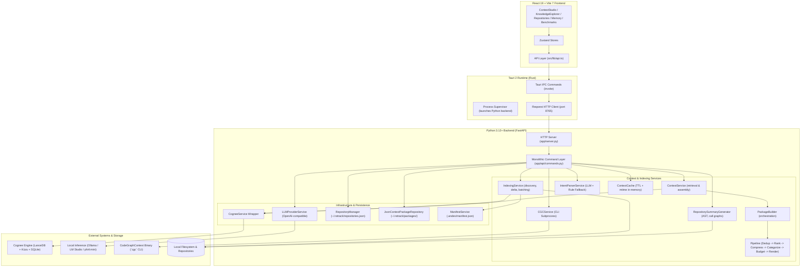
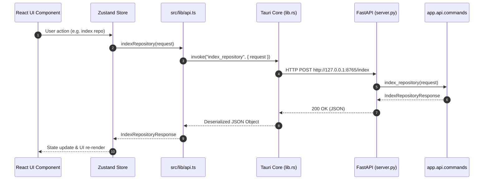
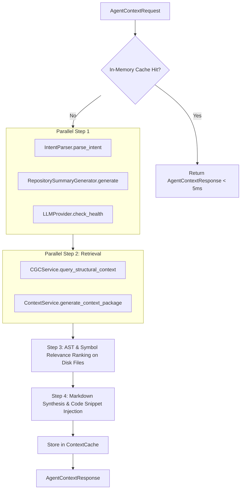

# RE:Track — Current Architecture Specification (Baseline Audit)

> **Document Status**: Authoritative Baseline (Phase 0)  
> **Date**: 2026-08-20  
> **Source Code Commit**: `ed4712ed6f7d8f5c2655fdd436e7bd9113e18117`  
> **Purpose**: Document the exact, unmodified state of RE:Track prior to any architectural refactoring.

---

## 1. System Overview

RE:Track (RefinedEngine Track) is a local, persistent context engine and memory system for AI-assisted software development. It analyzes software repositories, extracts structural call graphs and symbols, ingests semantic knowledge into vector and graph databases, and generates deterministic, budget-enforced Context Packages for developer tasks and external AI coding agents.

### High-Level Architecture Diagram



---

## 2. Repository Structure

The physical repository is organized into three primary tiers:

```text
re-track/
├── backend/                  # Python backend application
│   ├── app/
│   │   ├── api/              # API layer: commands.py, schemas.py, benchmarks.py
│   │   ├── cli/              # Typer CLI application (main.py)
│   │   ├── config/           # Pydantic Settings & environment loaders (settings.py)
│   │   ├── core/             # Core utilities (logging.py)
│   │   ├── models/           # Domain and transport models (responses, repository, provider, agent_context, errors)
│   │   ├── server.py         # FastAPI application entrypoint & routing
│   │   └── services/         # Business logic, pipeline stages, storage managers
│   │       ├── pipeline/     # Categorization, compression, dedup, ranking, references
│   │       ├── sources/      # Local and GitHub repository source handlers
│   │       ├── budget_manager.py
│   │       ├── cgc_service.py
│   │       ├── cognee_service.py
│   │       ├── context_cache.py
│   │       ├── context_package_repository.py
│   │       ├── context_service.py
│   │       ├── indexing_service.py
│   │       ├── intent_parser.py
│   │       ├── llm_provider_service.py
│   │       ├── manifest_service.py
│   │       ├── package_builder.py
│   │       ├── renderer.py
│   │       ├── repository_manager.py
│   │       ├── repository_summary.py
│   │       └── stats_logger.py
│   ├── tests/                # Pytest test suite (297 test cases)
│   ├── retrack.py            # Uvicorn entrypoint script
│   └── requirements.txt      # Python dependencies
├── src/                      # React frontend application
│   ├── components/           # UI components categorized by feature
│   │   ├── benchmarks/       # Benchmark suite runners and charts
│   │   ├── context-builder/  # Context generation and prompt forms
│   │   ├── context-packages/ # Saved context package library
│   │   ├── dashboard/        # Global overview cards and stats
│   │   ├── memory/           # Memory topology, LanceDB tables, Kùzu graph
│   │   ├── repositories/     # Repository manager, scanner, import modal
│   │   ├── settings/         # LLM provider, Ollama, and Cognee settings
│   │   └── shared/           # Common alerts, headers, badges
│   ├── hooks/                # React hooks (useHealthPoll, etc.)
│   ├── lib/                  # API client bridge (`api.ts`) & utilities
│   ├── pages/                # Top-level route pages
│   ├── stores/               # Zustand state stores (context, memory, repo, settings, health)
│   ├── types/                # TypeScript interface definitions
│   └── main.tsx              # React DOM entrypoint
├── src-tauri/                # Tauri 2 desktop runtime (Rust)
│   ├── src/
│   │   ├── main.rs           # Tauri entrypoint
│   │   └── lib.rs            # Process supervisor & HTTP-to-IPC proxy
│   ├── Cargo.toml            # Rust dependencies (tauri, reqwest, serde)
│   └── tauri.conf.json       # Tauri app configuration
├── docs/                     # Documentation hierarchy and specifications
└── scripts/                  # Tauri & development automation scripts
```

---

## 3. Backend Architecture

### 3.1 Application Entrypoints

1. **HTTP Server Entrypoint (`retrack.py` / `andescontext.py`)**:
   - Launches `uvicorn app.server:app --host 127.0.0.1 --port 8765 --log-level info`.
2. **CLI Entrypoint (`app/cli/main.py`)**:
   - Typer command line application exposing `health`, `status`, `index`, `context`, and `forget`.
   - Directly executes async commands via `asyncio.run(app.api.commands.*)`.
3. **FastAPI Lifespan (`app/server.py`)**:
   - Initializes backend dependencies via `lifespan(app: FastAPI)` calling `await initialize_backend()`.

### 3.2 Service Inventory & Responsibilities

| Service | Primary Responsibility | Direct Dependencies |
| :--- | :--- | :--- |
| `app.api.commands` | Monolithic command dispatcher & business logic coordinator | All services, FastAPI schemas, LanceDB, Kùzu, Filesystem |
| `IndexingService` | File tree traversal, `.gitignore` pruning, delta manifest evaluation, outline generation, Cognee ingestion | `CogneeService`, `ManifestService`, `RepositorySummaryGenerator`, `MarkdownRenderer` |
| `RepositorySummaryGenerator` | Deterministic AST analysis (Python `ast`, TS/JS regex), symbol extraction, call graph construction, framework detection | Python Standard Library (`ast`, `hashlib`, `re`, `pathlib`) |
| `ContextService` | Orchestrates Cognee memory recall and delegates to `PackageBuilder` | `CogneeService`, `PackageBuilder` |
| `PackageBuilder` | Coordinates 8-stage context assembly pipeline | `Deduplicator`, `Ranker`, `Compressor`, `Categorizer`, `BudgetManager`, `ReferenceResolver`, `MarkdownRenderer` |
| `BudgetManager` | Priority-based token budget enforcement (Critical=5, High=4, Medium=3, Low=1-2) | Pydantic response models |
| `CogneeService` | Thin wrapper for Cognee memory SDK (add, remember, recall, cognify, forget, dataset queries, vector stats, graph stats) | `cognee` SDK, LanceDB connection, Kùzu graph engine |
| `LLMProviderService` | OpenAI-compatible HTTP client for Ollama / LM Studio; inspects loaded models and quantization tiers (`phi4:mini` checks) | `httpx`, `pydantic` |
| `IntentParserService` | Developer task intent extraction using local LLM with rule-based regex fallback | `LLMProviderService`, `pydantic` |
| `CGCService` | Structural code graph extraction by executing external `cgc` CLI queries | `asyncio.subprocess`, `shutil`, `pydantic` |
| `ManifestService` | Per-repository incremental indexing delta tracking (`.andes/manifest.json`) | Filesystem JSON |
| `RepositoryManager` | In-memory and disk repository list management (`~/.retrack/repositories.json`) | `LocalSource`, `GitHubSource`, Filesystem JSON |
| `JsonContextPackageRepository` | CRUD persistence for generated Context Packages (`~/.retrack/packages/*.json`) | Filesystem JSON |
| `ContextCache` | High-speed in-memory TTL and mtime-based context synthesis cache | Python `time`, `hashlib` |

---

## 4. Frontend & Backend Communication Boundary



### Communication Characteristics
- **Tauri IPC is an HTTP Proxy**: The Rust layer in `src-tauri/src/lib.rs` does not execute backend logic in Rust. It launches Python and proxies all `invoke()` calls to `http://127.0.0.1:8765` using `reqwest`.
- **No Direct Coupling to Python Runtime**: The frontend only depends on HTTP/JSON schema contracts defined in `src/lib/api.ts`.
- **Truth Boundary Guarantee**: The UI never generates synthetic AST graphs, mock memory vectors, or fallback node relationships; it relies entirely on authoritative backend responses.

---

## 5. Context Generation Pipeline Audit

The backend contains two distinct context generation pathways:

### Pathway A: Interactive / UI Context Package Generation (`/context`)
1. **Request Validation**: Validates non-empty task prompt and non-empty dataset list.
2. **Cognee Recall**: Queries `_cognee_service.recall(task, datasets, top_k)` for vector/semantic matches.
3. **Pipeline Assembly (`PackageBuilder`)**:
   - **Step 1: Deduplication (`Deduplicator`)**: Normalizes whitespace and text (case-insensitive); retains highest-scoring duplicate.
   - **Step 2: Multi-Factor Ranking (`Ranker`)**: Computes `CompositeScore = SemanticRelevance × Confidence × TypeWeight` (file=1.0, code=0.9, text=0.7).
   - **Step 3: Semantic Compression (`Compressor`)**: Identifies entries with token overlap ratio $\ge 0.35$ and retains the more concise variant while preserving code identifiers.
   - **Step 4: Categorization (`Categorizer`)**: Classifies results into section types: `files`, `architecture`, `apis`, `conventions`, `decisions`, `knowledge`.
   - **Step 5: Section Building**: Converts categorized memories into `PackageSection` blocks.
   - **Step 6: Budget Enforcement (`BudgetManager`)**: Compares character estimate ($1\text{ token} \approx 4\text{ chars}$) against target budget. Drops Low priority $\to$ drops Medium priority $\to$ compresses High priority by 50% $\to$ preserves Critical sections.
   - **Step 7: Reference Resolution (`ReferenceResolver`)**: Extracts file paths and memory provenance references.
   - **Step 8: Markdown Rendering (`MarkdownRenderer`)**: Renders clean GitHub Flavored Markdown with section dividers.

### Pathway B: Agent Middleware Pipeline (`/api/v1/context`)


---

## 6. Repository Analysis & AST Pipeline Audit

Repository scanning and outline generation are 100% deterministic and do not consume LLM inference:
1. **File Tree Traversal (`discover_files`)**: Uses Python `Path.walk()` with in-place directory pruning (`.git`, `node_modules`, `dist`, `.venv`, `.agents`, etc., plus parsed `.gitignore` rules).
2. **Extension & Pattern Filtering (`filter_files`)**: Retains supported code/documentation extensions (`.py`, `.ts`, `.tsx`, `.rs`, `.go`, `.md`, etc.).
3. **Incremental Delta Evaluation (`ManifestService`)**: Reads `<repo>/.andes/manifest.json` and hashes file mtimes/sizes to detect `added`, `modified`, `deleted`, and `unchanged` files.
4. **AST Symbol & Call Graph Analysis (`RepositorySummaryGenerator`)**:
   - Python files: Parsed using Python's standard `ast` module to extract classes, functions, async functions, decorators, and AST call nodes/edges.
   - TypeScript/JavaScript files: Parsed using robust regular expressions to detect classes, functions, exported constants, React components, and import statements.
   - Tech stack & framework detection: Scans marker files (`package.json`, `Cargo.toml`, `requirements.txt`, `vite.config.ts`, etc.).
5. **Cold Start Architecture Outline**: Generated via `MarkdownRenderer._render_summary()` and ingested into Cognee memory via `_cognee.add()`.

---

## 7. Cognee Integration Audit

Cognee dependencies are isolated within `backend/app/services/cognee_service.py` with direct query invocations in `commands.py`:

```text
Cognee Coupling Points:
├── Ingestion:
│   ├── cognee.add(data, dataset_name)
│   └── cognee.remember(data, dataset_name)
├── Retrieval:
│   └── cognee.recall(query_text, datasets, top_k)
├── Indexing & Extraction:
│   └── cognee.cognify(datasets)
├── Deletion:
│   └── cognee.forget(dataset, dataset_id, data_id)
├── Introspection:
│   ├── cognee.datasets.list_datasets()
│   ├── cognee.modules.data.methods.get_dataset_data(dataset_id)
│   ├── cognee.infrastructure.databases.vector.get_vector_engine() -> LanceDB connection
│   └── cognee.infrastructure.databases.graph.get_graph_engine() -> Kùzu graph engine
└── Configuration:
    └── settings.configure_cognee() (Sets ENV vars: VECTOR_DB_PROVIDER, GRAPH_DATABASE_PROVIDER, OLLAMA_ENDPOINT, etc.)
```

---

## 8. Model & Provider Integration Audit

- **Inference Client (`LLMProviderService`)**: Uses `httpx.AsyncClient` against OpenAI-compatible endpoints (`/models` and `/chat/completions`).
- **Provider Support**: Ollama (`http://localhost:11434/v1`), LM Studio (`http://localhost:1234/v1`), or remote OpenAI-compatible servers.
- **Model Evaluation**:
  - Checks if active model is `phi4:mini`.
  - Infers quantization tier (`Q6_K`, `Q8_0`, `FP16`, `Q5_K_M`, `Q4_K_M`, `UNKNOWN`).
  - Emits non-blocking warnings if running $< \text{Q6}$ quantization on constrained 8GB hardware.
- **Embeddings**: Handled through Cognee (`nomic-embed-text` with 768 dimensions).
- **Execution Boundaries**:
  - LLM Reasoning: Intent parsing (`intent_parser.py`) and prompt recommendations (`generate_suggested_prompts`).
  - Core Synthesis & Formatting: Deterministic Python pipeline (no LLM required for basic Context Packages).

---

## 9. Current Public API Inventory

The backend exposes 25 HTTP operations across 8 domain areas:

| Operation / Path | Method | Input Schema | Output Schema | Implementation Handler | Major Dependencies |
| :--- | :--- | :--- | :--- | :--- | :--- |
| `GET /health` | GET | None | `HealthResponse` | `commands.health()` | psutil, socket, CogneeService |
| `GET /status` | GET | None | `BackendStatusResponse` | `commands.get_backend_status()` | Settings, CogneeService |
| `GET /datasets` | GET | None | `DatasetListResponse` | `commands.list_datasets()` | CogneeService |
| `GET /datasets/{id}/items` | GET | `dataset_id: str` | `DatasetDataItemsResponse` | `commands.get_dataset_items()` | CogneeService |
| `POST /index` | POST | `IndexRepositoryRequest` | `IndexRepositoryResponse` | `commands.index_repository()` | IndexingService, CogneeService |
| `POST /context` | POST | `GenerateContextRequest` | `ContextResponse` | `commands.generate_context()` | ContextService, PackageBuilder |
| `POST /forget` | POST | `ForgetDatasetRequest` | `dict` | `commands.forget_dataset()` | CogneeService |
| `GET /repositories` | GET | None | `RepositoryListResponse` | `commands.get_repository_summaries()` | Filesystem JSON store |
| `GET /repos` | GET | None | `RepositoryListResponse` | `commands.list_repositories()` | RepositoryManager |
| `POST /repos` | POST | `RepositoryCreateRequest` | `RepositoryResponse` | `commands.create_repository()` | RepositoryManager |
| `POST /repos/{id}/scan` | POST | `repo_id: str` | `ScanResultResponse` | `commands.scan_repository()` | RepositoryManager, IndexingService |
| `GET /repos/{id}/progress` | GET | `repo_id: str` | `dict` | `commands.get_repository_progress()` | In-memory progress map |
| `DELETE /repos/{id}` | DELETE | `repo_id: str` | `dict` | `commands.delete_repository()` | RepositoryManager, CogneeService |
| `GET /repos/{id}/prompts` | GET | `repo_id: str` | `dict` | `commands.generate_suggested_prompts()` | LLMProviderService, AST |
| `GET /packages` | GET | None | `ContextPackageListResponse` | `commands.list_context_packages()` | JsonContextPackageRepository |
| `POST /packages` | POST | `ContextPackageSaveRequest` | `ContextPackageResponse` | `commands.save_context_package()` | JsonContextPackageRepository |
| `GET /packages/{id}` | GET | `package_id: str` | `ContextPackageResponse` | `commands.get_context_package()` | JsonContextPackageRepository |
| `DELETE /packages/{id}` | DELETE | `package_id: str` | `dict` | `commands.delete_context_package()` | JsonContextPackageRepository |
| `POST /packages/{id}/append` | POST | `ContextPackageAppendRequest` | `ContextPackageResponse` | `commands.append_context_package()` | JsonContextPackageRepository |
| `GET /dashboard/stats` | GET | None | `DashboardStats` | `commands.get_dashboard_stats()` | CogneeService, Store |
| `GET /memory/stats` | GET | None | `MemoryStatsResponse` | `commands.get_memory_stats()` | CogneeService |
| `GET /memory/graph` | GET | `dataset: str?` | `MemoryGraphResponse` | `commands.get_memory_graph()` | CogneeService (Kùzu) |
| `GET /memory/vectors` | GET | None | `MemoryVectorsResponse` | `commands.get_memory_vectors()` | CogneeService (LanceDB) |
| `POST /memory/cognify` | POST | `CognifyRequest` | `CognifyResponse` | `commands.cognify_dataset()` | CogneeService |
| `POST /benchmarks/run` | POST | None | `BenchmarkSuiteResponse` | `commands.run_benchmark()` | BenchmarkRunner, ContextService |
| `POST /provider/update` | POST | `UpdateProviderRequest` | `dict` | `commands.update_provider()` | LLMProviderService |
| `GET /settings` | GET | None | `AppSettingsResponse` | `commands.get_app_settings()` | Settings |
| `POST /settings/cognee` | POST | `CogneeSettingsRequest` | `AppSettingsResponse` | `commands.update_cognee_settings()` | Settings, CogneeService |
| `POST /api/v1/context` | POST | `AgentContextRequest` | `AgentContextResponse` | `commands.get_agent_context()` | CGC, Intent, Summary, Cache |

---

## 10. Architectural Coupling Classification

| Component / Layer | Current Dependencies | Coupling Level | Target Future Boundary |
| :--- | :--- | :--- | :--- |
| **Context Synthesis** | `PackageBuilder`, `Pipeline`, `BudgetManager` | **Low** (Clean Domain) | `ContextEngine` (Core Domain) |
| **Repository AST Analysis** | `RepositorySummaryGenerator` (pure AST & regex) | **Low** (Clean Domain) | `RepositoryAnalyzer` (Core Domain) |
| **Incremental Tracking** | `ManifestService` (reads `.andes/manifest.json`) | **Medium** (FS coupling) | `ManifestPort` / Filesystem Adapter |
| **Agent Context Synthesis** | `commands.py` (inline orchestration) | **High** (Leaked into API) | `AgentContextUseCase` in Application Core |
| **Memory / Vector / Graph** | Direct Cognee SDK, LanceDB, Kùzu calls | **High** (Deep SDK leak) | `MemoryPort` / `CogneeAdapter` |
| **LLM Inference** | `LLMProviderService` (httpx OpenAI calls) | **Medium** | `ModelPort` / `OpenAICompatibleAdapter` |
| **Structural Code Graph** | `CGCService` (spawns `cgc` CLI subprocess) | **Medium** | `StructuralGraphPort` / `CGCAdapter` |
| **Command Layer** | `commands.py` (2,158 lines of monolithic logic) | **Severe** (God module) | Application Use Cases & Domain Services |
| **HTTP Transport** | `server.py` (FastAPI routing) | **Medium** | `FastAPIHttpAdapter` (Interface Adapter) |
| **Desktop Shell** | `src-tauri` (Proxies IPC $\to$ HTTP) | **Low** (Pure proxy) | Standalone Desktop UI Adapter |
| **CLI Application** | `cli/main.py` (calls `commands.py` via asyncio) | **Medium** | Standalone CLI Interface Adapter |

---

## 11. Core Domain vs. Infrastructure Separation

```text
+---------------------------------------------------------------------------------------+
|                                    CORE DOMAIN                                        |
|  - Deterministic AST Call Graph & Symbol Extraction (RepositorySummaryGenerator)      |
|  - Multi-Stage Context Pipeline: Dedup, Rank, Compress, Categorize, Reference Resolve |
|  - Token Budget Enforcement & Soft Allocation (BudgetManager)                        |
|  - Markdown Context Package Rendering (MarkdownRenderer)                             |
|  - High-Speed Synthesis Cache (ContextCache)                                          |
|  - Domain Entities (ContextPackage, RepositorySummary, ParsedIntent, Manifest)        |
+---------------------------------------------------------------------------------------+
                                        ▲
                                        │ (Uses Ports / Protocols)
+---------------------------------------------------------------------------------------+
|                               INFRASTRUCTURE & ADAPTERS                               |
|  - Memory & Graph Store: Cognee SDK, LanceDB, Kùzu (MemoryPort)                       |
|  - Model Inference: Ollama, LM Studio, OpenAI HTTP client (ModelPort)                 |
|  - Structural Graph: CodeGraphContext CLI Subprocess (StructuralGraphPort)            |
|  - Persistence: JSON files in ~/.retrack/ and .andes/ (RepositoryPort, PackagePort)  |
|  - Interfaces: FastAPI HTTP Server, Typer CLI, React Desktop GUI via Tauri IPC       |
+---------------------------------------------------------------------------------------+
```

---

## 12. Current Architectural Risks & Technical Debt

1. **God Module in `app.api.commands`**: At 2,158 lines, `commands.py` acts as service container, repository manager, database accessor, and pipeline orchestrator.
2. **Leaked Database Internals**: `commands.py` and `cognee_service.py` directly reach into internal LanceDB connection objects and Kùzu table scans, bypassing SDK abstractions.
3. **Legacy Path Fallbacks**: Scattered references to `~/.andes` and `.andes/` coexist alongside `~/.retrack` and `.retrack/`.
4. **Missing Import in `server.py`**: `append_context_package` is invoked in `server.py` but is not imported from `commands.py` (functional bug if route is hit).
5. **Pydantic v2 Deprecation Warnings**: 15 deprecation warnings triggered during test runs due to Cognee's legacy Pydantic usage (`json_schema_extra` / `env` in Field).
