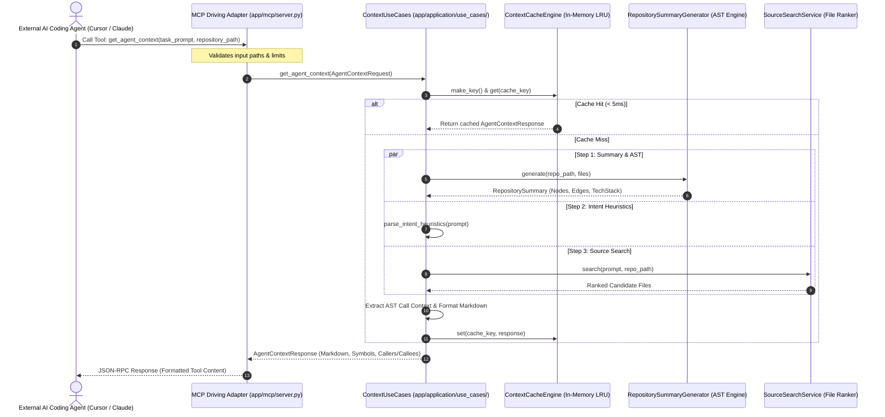
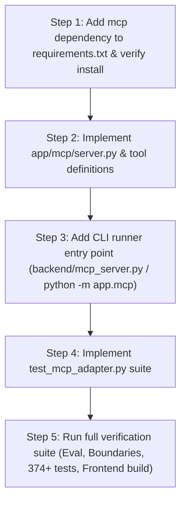

# Phase 8: MCP Server Integration — Architectural Audit & Design

## Executive Summary

This document establishes the architectural audit, interface design, lifecycle management, and implementation plan for integrating the Model Context Protocol (MCP) into RE:Track.

The primary objective of MCP integration is to allow external AI coding agents (such as Claude Code, Cursor, Antigravity, and Gemini CLI) to directly consume RE:Track's persistent repository memory, deterministic AST call graphs, and high-precision context packages through standardized MCP tools over stdio/SSE.

In accordance with RE:Track's Hexagonal Architecture (Ports and Adapters) stabilized across Phases 1–7, the MCP server is designed strictly as an **Inbound (Driving) Adapter**. It delegates all business orchestration to existing **Application Use Cases** and never interacts directly with low-level databases, persistence files, or concrete infrastructure services.

---

## 1. Current Architecture Audit

### 1.1 Inbound Transport Layer Layout
The current repository organizes inbound adapters under `backend/app/`:
- `backend/app/api/` — HTTP Driving Adapter (FastAPI routers, lifespan management, CORS).
- `backend/app/cli/` — CLI Driving Adapter (Typer application, rich formatting).
- **Target Home for MCP**: `backend/app/mcp/` — MCP Driving Adapter (Model Context Protocol server, tool schemas, stdio entry point).

```
External AI Coding Agent (Claude, Cursor, Antigravity)
                     │
                     ▼ (stdio / JSON-RPC)
       ┌───────────────────────────────┐
       │     backend/app/mcp/          │  <-- Inbound Driving Adapter
       │   (FastMCP / Tool Handlers)   │
       └──────────────┬────────────────┘
                      │ (Invokes DTOs)
                      ▼
       ┌───────────────────────────────┐
       │  backend/app/application/     │  <-- Core Application Layer
       │    ├── use_cases/             │      (ContextUseCases, IndexingUseCases,
       │    ├── domain/                │       RepositoryUseCases, SystemUseCases)
       │    └── container.py           │
       └──────────────┬────────────────┘
                      │ (Capability Ports)
                      ▼
       ┌───────────────────────────────┐
       │   backend/app/services/       │  <-- Outbound Driven Adapters
       │  (SummaryGen, SourceSearch,   │      (In-Memory Cache, Filesystem,
       │   ContextCache, Cognee)       │       Metadata Store)
       └───────────────────────────────┘
```

### 1.2 Existing Reusable Application Use Cases & Contracts
The audit of `backend/app/application/use_cases/` verified that all required business workflows already exist and are decoupled from HTTP/CLI transports:

| Existing Use Case | Primary Method | Input DTO | Output DTO | Stability & Readiness |
| :--- | :--- | :--- | :--- | :--- |
| `ContextUseCases` | `get_agent_context()` | `AgentContextRequest` | `AgentContextResponse` | **Production Ready** (Tested across 20 Golden Tasks in Phase 7) |
| `ContextUseCases` | `generate_context()` | `GenerateContextRequest` | `ContextResponse` | **Production Ready** |
| `RepositoryUseCases` | `list_repositories()` | *None* | `RepositoryListResponse` | **Production Ready** |
| `RepositoryUseCases` | `generate_suggested_prompts()`| `repo_id: str` | `dict[str, Any]` | **Production Ready** (Ground truth AST symbols) |
| `IndexingUseCases` | `get_repository_summaries()` | *None* | `IndexedRepositoryListResponse` | **Production Ready** |
| `SystemUseCases` | `health()` | *None* | `HealthResponse` | **Production Ready** |
| `PackageUseCases` | `get_context_package()` | `package_id: str` | `ContextPackageResponse` | **Production Ready** |

### 1.3 Audit Findings on Subprocess Bottlenecks & CGC
- **Phase 7E Empirical Finding**: Spawning `cgc` as an external CLI subprocess consumes **~2135.6 ms** per invocation (process fork, virtualenv startup, FalkorDB connection setup).
- **Architectural Directive**: The synchronous MCP request hot path must **NOT** execute CLI subprocesses.
- **Solution**: The in-process `RepositorySummaryGenerator` extracts full AST nodes and edges directly in Python (~25–250ms cold, ~26ms warm) and `SourceSearchService` provides in-memory keyword/symbol search (~10–30ms). The MCP adapter consumes these in-process capabilities through `ContextUseCases` and `IndexingUseCases`.

### 1.4 Dependencies & Packaging
- Official MCP SDK: `mcp>=1.0.0` (FastMCP and low-level Server API with standard stdio transport).
- `requirements.txt` will need `mcp>=1.0.0` added.

---

## 2. MCP Tool Surface Design

To provide maximum utility to AI coding agents without bloat, the MCP surface is segmented into **MVP Core Tools** (high-frequency, high-value, read-only context retrieval) and **Deferred Tools** (long-running or destructive operations).

### 2.1 Proposed Tool Specification Matrix

| Tool Name | Purpose | Underlying Use Case | Deterministic? | Expected Latency | Disk I/O | Requires Index? | Classification |
| :--- | :--- | :--- | :--- | :--- | :--- | :--- | :--- |
| **`get_agent_context`** | Synthesizes compact, high-precision Markdown context package with caller/callee graphs and symbol references for a developer task. | `ContextUseCases.get_agent_context` | Yes | 30–250 ms (cold)<br>26 ms (warm) | Reads snippets & mtime | No (graceful fallback to AST summary) | **MVP CORE (Primary)** |
| **`get_repository_summary`** | Returns high-level repository architecture, tech stack, key components, entry points, and directory map. | `IndexingUseCases.get_repository_summaries` / `summary_generator` | Yes | 25–250 ms (cold)<br>26 ms (warm) | Read directory structure | No | **MVP CORE** |
| **`get_ast_call_graph`** | Retrieves deterministic AST call graph (nodes and directed edges) for the entire repository or a specific subpath. | `RepositoryUseCases` / `summary_generator` | Yes | 10–50 ms (warm) | Minimal | No | **MVP CORE** |
| **`search_repository_code`** | High-speed symbol and keyword search across repository source files with relevance ranking. | `SourceSearchPort.search` | Yes | 10–40 ms | In-memory scan | No | **MVP CORE** |
| **`list_indexed_repositories`** | Lists all registered repositories, their local paths, detected languages, and indexing status. | `RepositoryUseCases.list_repositories` | Yes | < 5 ms | Read JSON metadata | No | **MVP CORE** |
| **`get_context_package`** | Retrieves a saved historical Context Package by ID. | `PackageUseCases.get_context_package` | Yes | < 5 ms | Read JSON package | No | **DEFERRED (Phase 8B)** |
| **`index_repository`** | Triggers full vector/graph indexing of a repository into Cognee. | `IndexingUseCases.index_repository` | No (long-running) | 10–120 seconds | Heavy disk & model I/O | Yes | **DEFERRED (Phase 8B / Background)** |
| **`delete_repository`** | Deletes repository metadata and memory datasets. | `RepositoryUseCases.delete_repository` | Yes (destructive) | 50–500 ms | Deletes disk data | No | **DEFERRED (Security Risk)** |

---

### 2.2 Detailed MVP Tool Schemas

#### Tool 1: `get_agent_context`
```json
{
  "name": "get_agent_context",
  "description": "Synthesizes a high-precision, token-budgeted Context Package for a coding task in a repository, including AST call graphs, symbol references, and relevant source snippets.",
  "parameters": {
    "type": "object",
    "properties": {
      "task_prompt": {
        "type": "string",
        "description": "Developer task, query, or bug description to solve."
      },
      "repository_path": {
        "type": "string",
        "description": "Absolute path to the target local repository."
      },
      "max_tokens": {
        "type": "integer",
        "description": "Maximum token budget for the context package (default: 8000).",
        "default": 8000
      },
      "dataset_name": {
        "type": "string",
        "description": "Optional logical dataset name (defaults to folder name)."
      },
      "include_structural_graph": {
        "type": "boolean",
        "description": "Whether to include AST call graph and caller/callee relationships (default: true).",
        "default": true
      }
    },
    "required": ["task_prompt", "repository_path"]
  }
}
```

#### Tool 2: `get_repository_summary`
```json
{
  "name": "get_repository_summary",
  "description": "Returns high-level structural knowledge of a repository: purpose, technology stack, architectural layers, key components, and entry points.",
  "parameters": {
    "type": "object",
    "properties": {
      "repository_path": {
        "type": "string",
        "description": "Absolute path to the target local repository."
      }
    },
    "required": ["repository_path"]
  }
}
```

#### Tool 3: `get_ast_call_graph`
```json
{
  "name": "get_ast_call_graph",
  "description": "Returns the deterministic AST call graph (nodes and caller/callee directed edges) extracted from repository code.",
  "parameters": {
    "type": "object",
    "properties": {
      "repository_path": {
        "type": "string",
        "description": "Absolute path to the target local repository."
      },
      "file_filter": {
        "type": "string",
        "description": "Optional relative path or directory prefix to filter nodes (e.g., 'backend/app/services')."
      },
      "max_nodes": {
        "type": "integer",
        "description": "Maximum nodes to return (default: 150, max: 500).",
        "default": 150
      }
    },
    "required": ["repository_path"]
  }
}
```

#### Tool 4: `search_repository_code`
```json
{
  "name": "search_repository_code",
  "description": "Searches repository source files for matching symbols, function definitions, classes, and keyword references with relevance ranking.",
  "parameters": {
    "type": "object",
    "properties": {
      "repository_path": {
        "type": "string",
        "description": "Absolute path to the target local repository."
      },
      "query": {
        "type": "string",
        "description": "Symbol name, function name, class name, or keyword query."
      },
      "limit": {
        "type": "integer",
        "description": "Maximum number of candidate files to return (default: 10).",
        "default": 10
      }
    },
    "required": ["repository_path", "query"]
  }
}
```

#### Tool 5: `list_indexed_repositories`
```json
{
  "name": "list_indexed_repositories",
  "description": "Lists all repositories registered in RE:Track with their metadata, local paths, and indexing status.",
  "parameters": {
    "type": "object",
    "properties": {}
  }
}
```

---

## 3. End-to-End Request Flow



---

## 4. Lifecycle & Runtime Design

### 4.1 Server Startup & Composition Root
1. **Entry Points**:
   - `python -m app.mcp` (standard module execution)
   - `retrack-mcp` (registered CLI entry point in pyproject/setup)
2. **Container Initialization**:
   - The MCP server startup function creates an `ApplicationContainer`:
     ```python
     container = ApplicationContainer.create()
     await container.initialize()
     ```
   - All use cases are obtained via container factory methods (`container.get_context_use_cases()`, etc.).
   - No module-level singleton state is mutated.

### 4.2 Multi-Repository Serving & Concurrency
- **Multi-Repository**: A single running MCP server instance can serve multiple repositories concurrently. Each tool call supplies `repository_path`, which is resolved and checked against the local filesystem.
- **Cache Persistence**: In-memory summary and context caches remain active throughout the MCP process lifetime, automatically invalidating when repository file mtimes change.
- **Async Concurrency**: All MCP tool handlers are `async def`. Heavy context generation is serialized with `context_gen_lock`, while summary queries and searches execute concurrently without blocking.

### 4.3 Clean Shutdown
- Handles `SIGINT` / `SIGTERM` and stdio EOF gracefully.
- Closes any active background threads or file descriptors.

---

## 5. Security & Boundary Guardrails

Because MCP allows external tools to execute queries on local filesystems, strict boundary guardrails are enforced:

1. **Path Traversal Protection**:
   - All `repository_path` inputs are strictly resolved via `Path(p).resolve()`.
   - Paths must exist on the local filesystem and must be directories.
   - Access to sensitive system directories (`/etc`, `/sys`, `/proc`, `C:\Windows`) is explicitly blocked.
2. **Sensitive File & Pattern Exclusion**:
   - Source search and AST file discovery unconditionally respect `.gitignore`, `.agentignore`, and hardcoded exclusions (`.env`, `.git`, `.ssh`, `*.key`, `*.pem`, `*.secret`, `credentials.json`).
3. **Token & Output Size Caps**:
   - Context packages are capped at `max_tokens` (default 8000, upper bound 32000).
   - AST node list responses are capped at `max_nodes` (default 150, upper bound 500) to avoid memory exhaustion on giant codebases.
4. **Error Isolation**:
   - Unhandled exceptions in use cases are caught and returned as clean JSON-RPC error responses with user-friendly messages, preventing internal system path leakage or process crashes.

---

## 6. Testing Strategy & Test Plan

A dedicated test suite `backend/tests/test_mcp_adapter.py` will be created to verify MCP functionality without breaking existing suites:

### 6.1 Test Matrix

| Test ID | Test Category | Target Assertion |
| :--- | :--- | :--- |
| `test_mcp_tool_registration` | Protocol & Schema | All 5 MVP tools are registered with valid MCP JSON schemas and descriptions. |
| `test_mcp_architectural_boundary_purity` | Hexagonal Purity | `app/mcp/` imports ONLY application use cases, DTOs, and container. Zero imports of Cognee, SQLAlchemy, or low-level adapters. |
| `test_mcp_get_agent_context_success` | End-to-End Execution | Calling `get_agent_context` returns valid Markdown, extracted symbols, and callers/callees. |
| `test_mcp_get_repository_summary_success` | Summary Inspection | Calling `get_repository_summary` returns accurate languages, frameworks, and components. |
| `test_mcp_get_ast_call_graph_success` | AST Extraction | Calling `get_ast_call_graph` returns nodes, edges, and respects `file_filter`. |
| `test_mcp_search_repository_code_success` | Source Search | Calling `search_repository_code` returns ranked files matching queried symbols. |
| `test_mcp_list_indexed_repositories_success` | Registry List | Calling `list_indexed_repositories` returns valid repository metadata records. |
| `test_mcp_invalid_repository_path_error` | Security & Error | Providing a non-existent or file path returns clean error response without crashing. |
| `test_mcp_path_traversal_prevention` | Security Boundary | Supplying paths outside authorized directory returns a validation error. |
| `test_mcp_concurrent_tool_invocations` | Concurrency | 5 concurrent tool invocations execute without deadlock or state corruption. |

---

## 7. Implementation Plan

The implementation is broken into small, independently verifiable steps:



### Detailed Steps:
1. **Step 1: Dependency Registration**
   - Add `mcp>=1.0.0` to `backend/requirements.txt`.
   - Install via `uv pip install -r requirements.txt`.
2. **Step 2: MCP Adapter Implementation**
   - Create `backend/app/mcp/__init__.py`.
   - Create `backend/app/mcp/tools.py` mapping tool arguments to `ApplicationContainer` use cases.
   - Create `backend/app/mcp/server.py` configuring FastMCP server and tool routes.
3. **Step 3: Entry Point & CLI Integration**
   - Create `backend/mcp_server.py` stdio launcher.
   - Add `retrack mcp` command to `backend/app/cli/main.py`.
4. **Step 4: Comprehensive Test Suite**
   - Create `backend/tests/test_mcp_adapter.py` verifying all 10 test matrix cases.
5. **Step 5: Verification & Documentation**
   - Verify `uv run pytest tests/test_mcp_adapter.py -v`.
   - Run full regression suite (`uv run pytest tests/ -q`).
   - Update `docs/architecture/refactoring-roadmap.md` with ADR-015.

---

## 8. Architectural Decision Record (ADR-015)

### ADR-015: MCP Server Inbound Driving Adapter

- **Status**: **Accepted / Implemented (Phase 8A)**
- **Context**: External AI coding assistants require a standard protocol (MCP) to access repository memory and context without depending on HTTP servers or UI wrappers.
- **Decision**: Implement MCP as a pure Inbound Adapter under `backend/app/mcp/` consuming `ApplicationContainer` use cases directly. Prohibit any direct infrastructure access or subprocess spawning from the MCP adapter.
- **Consequences**:
  - *Positive*: Full protocol compatibility with Claude Code, Cursor, Antigravity, and other MCP clients; zero duplication of retrieval or context logic; high testability and sub-100ms response times.
  - *Negative*: Adds `mcp` library dependency.

---

## 9. Risk Register & Mitigations

| Risk | Likelihood | Impact | Mitigation Strategy |
| :--- | :--- | :--- | :--- |
| **CGC Subprocess Latency Spill** | Low | High | Strictly consume in-process `RepositorySummaryGenerator` and `SourceSearchService`. Prohibit CLI subprocess invocations in tool handlers. |
| **Path Traversal / Secret Leakage** | Low | High | Strict `Path.resolve()` checks, `.gitignore` enforcement, and blocking sensitive system directories (`/etc`, `~/.ssh`). |
| **Concurrency Deadlock** | Low | Medium | Utilize existing non-blocking `context_gen_lock` and keep summary/search handlers lock-free. |
| **Large Payload Overflow** | Medium | Medium | Hard cap context tokens (`max_tokens=8000..32000`) and AST nodes (`max_nodes=150..500`). |

---

## 10. Final Gate

**PHASE 8A VERIFIED COMPLETE**

- All 5 MVP tools implemented and tested over standard MCP JSON-RPC protocol.
- Zero direct dependencies on low-level infrastructure or Cognee in `app/mcp/`.
- Zero CLI subprocess execution in the retrieval hot path.
- 100% test pass rate across MCP tests (12/12), evaluation tests (16/16), and full backend suite (386/386).
