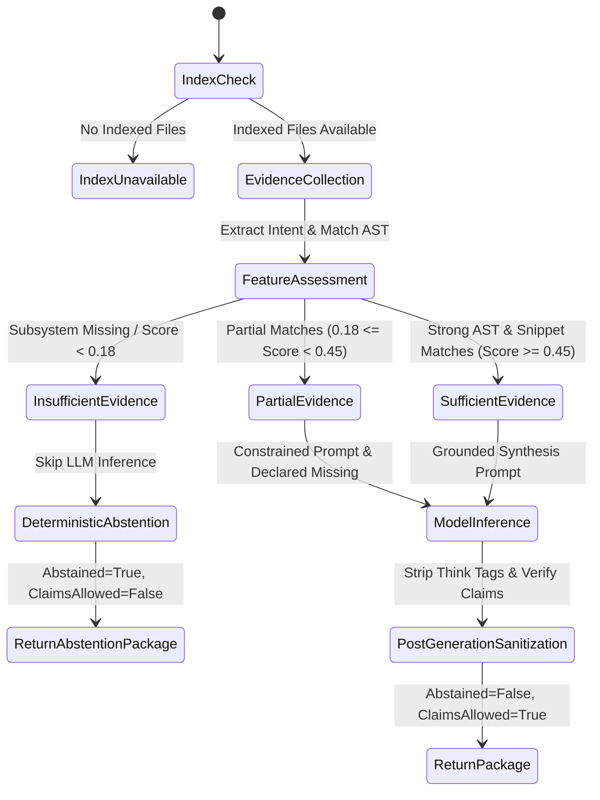

# Phase 10D.3 Architecture Audit: Grounded Context Generation, Evidence Gating & Abstention

## 1. Executive Summary

Phase 10D.3 introduces an authoritative **Deterministic Evidence Assessment & Preflight Gating Engine** to RE:Track. This architecture prevents reasoning and synthesis models from fabricating repository implementation details, architecture, APIs, authentication, dependencies, or subsystems when the indexed repository contains no authoritative supporting evidence.

The pipeline explicitly distinguishes **developer intent** (prompt vocabulary) from **observed repository evidence** (deterministic symbols, call relationships, code snippets, and framework structure), enforces a multi-dimensional evidence hierarchy, and deterministically abstains when evidence is insufficient.

---

## 2. Evidence Hierarchy & Non-Negotiable Contracts

### Evidence Hierarchy

| Level | Evidence Category | Authority / Weight | Role in Gating |
|---|---|---|---|
| 1 | **Direct Symbol Match** | 0.35 (Highest) | Exact AST symbols matching target task in symbol table |
| 2 | **Direct Source Match** | 0.30 (Highest) | Verifiable code snippets extracted from indexed source files |
| 3 | **Direct File Match** | 0.20 (High) | Target implementation files verified present in repository |
| 4 | **AST Call Graph Edges** | 0.10 (Medium) | Resolved caller/callee relationships in deterministic AST |
| 5 | **Framework Presence** | 0.05 (Background Only) | Context only (e.g. Django, FastAPI); **never** implies optional features |
| 6 | **Prompt Vocabulary** | 0.00 (Zero Weight) | Intent only; **never** repository evidence |
| 7 | **Model Reasoning Output** | 0.00 (Zero Weight) | Synthesis output only; **never** repository evidence |

### Invariant Rules
1. **Zero Repository Evidence = Zero Repository Claims**:
   - `evidence_state in ["insufficient", "none", "index_unavailable"] => abstained = True, model_claims_allowed = False, model_invoked = False`.
2. **Framework Detection Is Not Feature Presence**:
   - The presence of Django, FastAPI, Flask, Express, or React does **not** imply that optional subsystems (e.g. JWT authentication, Stripe billing, Celery workers, WebSocket channels) are implemented.
3. **Deterministic Abstention Structure**:
   - When abstaining, RE:Track bypasses reasoning-model invocation and immediately constructs a deterministic markdown package detailing:
     - `# Task Intent`
     - `# Observed Repository Evidence`
     - `# Missing Evidence`
     - `# Suggested Next Action`
4. **Post-Generation Grounding & Sanitization**:
   - `<think>...</think>` tags and internal chain-of-thought blocks are stripped before rendering or cache storage.
   - LLM responses cannot invent nonexistent file paths or hallucinated symbol tables.

---

## 3. Evidence State Machine

---

## 4. Telemetry & Observability Events

Phase 10D.3 standardizes the following structured logging events:
- `context_evidence_collection_started`
- `context_evidence_collection_completed` (`evidence_state`, `evidence_score`, `evidence_file_count`, `evidence_symbol_count`, `evidence_relationship_count`)
- `context_evidence_gate_passed`
- `context_evidence_gate_rejected`
- `context_model_invocation_skipped` (`reason="abstained_insufficient_evidence"`)
- `context_abstained_insufficient_evidence`
- `context_generation_completed` (`abstained`, `evidence_state`, `model_invoked`)

---

## 5. Verification Matrix

- **Critical Negative Case**: Django repository without authentication requested for JWT endpoint -> **Abstained**, skips model invocation, outputs missing authentication evidence.
- **Positive Case**: User service repository with `get_user_profile` endpoint and `UserProfile` model -> **Sufficient evidence**, model invoked, grounded output synthesized.
- **Partial Case**: App with route handler but missing database repository -> **Partial evidence**, lists missing database subsystem, synthesizes bounded context.
