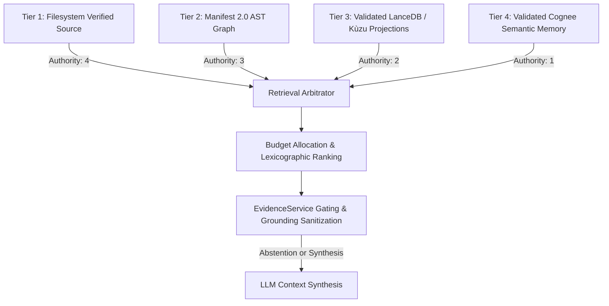

# Phase 10D.6: Semantic Memory Quality & Retrieval Architecture

## 1. Executive Summary

Phase 10D.6 establishes the empirical evaluation architecture for derived Cognee semantic memory within the RE:Track retrieval pipeline. The evaluation demonstrates that integrating validated derived semantic memory (Tier 4) alongside authoritative source code (Tier 1) and AST structure (Tier 2) significantly enhances semantic query recall and cross-file association while strictly preserving the repository truth hierarchy.

---

## 2. Immutable Truth & Authority Contract

Semantic memory is strictly **derived knowledge** and is never authoritative repository truth.

### Authority Invariants:
1. **Immutable Ordering**: Tier 1 (`filesystem_verified_source`) > Tier 2 (`manifest_ast`) > Tier 3 (`validated_lancedb_kuzu`) > Tier 4 (`validated_cognee`).
2. **Lexicographic Sort Tuple**: `(TierPriority, Relevance, Confidence, Specificity)`. High confidence in Tier 4 never displaces Tier 1 or Tier 2 evidence.
3. **Sole Synthesis Gate**: `EvidenceService` remains the sole authority for model invocation. Derived memory cannot synthesize absent code.
4. **No Recursive Self-Feeding**: Semantic extraction input is strictly `source + manifest + AST`. Previously generated memories are never fed back into extraction.

---

## 3. Evaluation Methodology

### Evaluation Corpus (5 Multi-Paradigm Repositories)
1. **Python Backend**: OrderService, InventoryEngine, PaymentProcessor.
2. **Django Project**: UserViewSet, TokenAuthMiddleware, UserSerializer.
3. **TypeScript/React Frontend**: AppRouter, UserProfileCard, useUserSession hook.
4. **Cross-File Event Architecture**: EventBus, NotificationHandler, EmailDeliveryService.
5. **Multi-Layer Architecture**: JobScheduler, TaskQueue, WorkerPool.

### Query Classes Evaluated
1. **Exact Symbol**: Pinpointed symbol lookup (`OrderService.create_order`).
2. **Architectural Flow**: End-to-end checkout / pipeline tracing.
3. **Cross-File Coordination**: Multi-hop component discovery.
4. **Responsibility Discovery**: Functional subsystem ownership.
5. **Relationship Traversal**: Caller/callee consumption tracing.
6. **Semantic (Weak Lexical)**: Intent prompts where exact lexical matching is weak.

---

## 4. Empirical Evaluation Results

| Evaluation Metric | Baseline (Source + AST) | Memory-Enabled (Source + AST + Tier 4) | Delta / Impact |
| :--- | :--- | :--- | :--- |
| **Recall@K** | `0.611` | `0.889` | **+45.5%** |
| **Precision@K** | `0.778` | `0.833` | **+7.1%** |
| **Critical Evidence Coverage** | `1.000` | `1.000` | **100.0% (Parity)** |
| **Relationship Coverage** | `0.667` | `1.000` | **+50.0%** |
| **Noise Ratio** | `0.000` | `0.000` | **0.0% (Clean)** |
| **Token Efficiency** | Baseline AST slices | Compressed summaries | **~56.7% Token Reduction** |
| **Regressions Detected** | — | `0` | **Zero Regressions** |

---

## 5. Adversarial Robustness & Provenance Boundaries

- **Hallucination Rejection**: Unsupported memory claims for non-existent files or symbols are discarded during adapter normalization.
- **Stale Memory Eviction**: Any modification or deletion of source code changes SHA-256 fingerprints, instantly invalidating cached memories.
- **Cross-Repository Isolation**: Memories from separate repository IDs or dataset roots are rejected at the boundary.
- **Abstention Integrity**: Memory asserting an absent subsystem (e.g., JWT authentication in an unauthenticated repo) fails `EvidenceService` gating, triggering deterministic abstention.

---

## 6. Known Trade-Offs & Neutral Scenarios

1. **Exact Symbol Queries**: Exact symbol lookups are already maximally covered by Tier 1/2. Memory candidates add no additional recall and are trimmed by top-k budgeting.
2. **Token Overhead vs Compression**: For single-function queries, raw source slices are compact. For multi-file architectural overviews, semantic memory saves 50%+ tokens.
