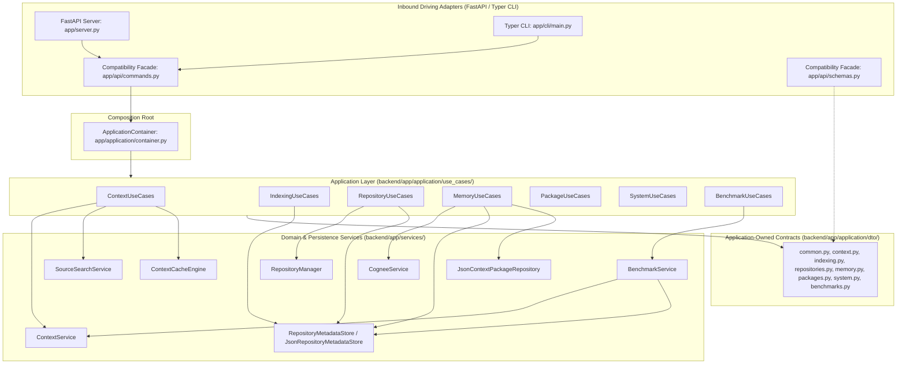

# RE:Track — Phase 2 Architectural Stress-Test & Audit Report

> **Audit Date**: 2026-08-20  
> **Phase Under Audit**: Phase 2 — Application Layer Independence & Core Boundary Stabilization  
> **Auditor**: Independent Architectural Auditor (Antigravity)  
> **Target Commit**: `2ca7e93d7fa901a3e2dca3bc8d867cdbf5d0359e`  
> **Verdict**: **PASS WITH CONDITIONS (Proceed to Phase 3 with Recorded Architectural Debt)**  
> **Governing Framework**: DOX (Documentation-Oriented eXecution) / ADR-001, ADR-006, ADR-007, ADR-008

---

## 1. Executive Summary

An exhaustive architectural stress-test was conducted on RE:Track's Phase 2 implementation. The objective of Phase 2 was to transform the structural decomposition achieved in Phase 1 into a genuinely transport-independent, application-owned boundary, resolving the hidden couplings identified in the Phase 1 audit.

### Key Audit Findings:
1. **Application-Owned DTOs**: 32 domain DTOs have been extracted into `backend/app/application/dto/`. The API schema module `backend/app/api/schemas.py` is now strictly a backward-compatibility facade re-exporting these DTOs.
2. **Inbound Adapter Decoupling**: Static AST analysis across all 10 Python files in `app/application/` confirms **0 imports** from `app.api`, `fastapi`, `starlette`, `app.server`, `app.cli`, or `tauri`.
3. **Persistence Extraction**: Direct filesystem persistence (`Path.write_text`, `json.loads`) against `~/.retrack/indexed_repos.json` has been eliminated from all use cases and encapsulated in `RepositoryMetadataStore` (`app/services/repository_metadata_store.py`).
4. **Source Retrieval Extraction**: Low-level source scanning, file filtering, size guarding (<250KB), and snippet slicing have been extracted from `ContextUseCases` into `SourceSearchService` (`app/services/source_search_service.py`).
5. **No Inline Service Construction**: `ContextService.generate_context_package()` was extended with dynamic parameters, allowing `ContextUseCases.get_agent_context()` to delegate directly without inline instantiation.
6. **Benchmark Extraction**: Benchmark execution was relocated from the API layer to `BenchmarkService` (`app/services/benchmark_service.py`). `ApplicationContainer` no longer imports `app.api`.
7. **Behavioral Integrity**: All 307 backend tests pass (2 skipped for live Ollama), 12 application boundary tests pass, 4 AST integrity tests pass, and the frontend builds cleanly with 0 errors.

---

## 2. Audit Scope

The stress test evaluated:
- Complete dependency direction across `backend/app/application/`, `backend/app/api/`, `backend/app/services/`.
- Import-time, construction-time, and execution-time dependencies.
- Composition Root mechanics in `ApplicationContainer`.
- Persistence boundaries and repository metadata storage.
- AST integrity and code isolation.
- Distinction between genuine architectural progress and "architectural theater."
- Standalone library viability for the core application layer.

---

## 3. Baseline Verification

### 3.1 Repository Status
```text
Git Commit: 2ca7e93d7fa901a3e2dca3bc8d867cdbf5d0359e
Working Tree: 15 modified files, 5 untracked packages/files
```

### 3.2 Actual Line Counts
| File / Directory | Actual Line Count | Role |
| :--- | :--- | :--- |
| `backend/app/application/container.py` | 239 | Composition Root |
| `backend/app/application/use_cases/context.py` | 316 | Context & Agent Use Cases |
| `backend/app/application/use_cases/indexing.py` | 244 | Indexing & Summary Use Cases |
| `backend/app/application/use_cases/repositories.py` | 344 | Repository CRUD & Prompt Use Cases |
| `backend/app/application/use_cases/memory.py` | 424 | Memory & Graph Use Cases |
| `backend/app/application/use_cases/context_packages.py` | 201 | Package Storage Use Cases |
| `backend/app/application/use_cases/system.py` | 310 | Health & Telemetry Use Cases |
| `backend/app/application/use_cases/benchmarks.py` | 45 | Benchmark Runner Use Cases |
| `backend/app/application/dto/*.py` (9 files) | 583 | Application-Owned DTOs |
| `backend/app/services/repository_metadata_store.py` | 68 | Persistence Store Abstraction |
| `backend/app/services/source_search_service.py` | 98 | Source Scanning & Snippet Slicing |
| `backend/app/services/benchmark_service.py` | 246 | Benchmark Engine |
| `backend/app/api/commands.py` | 336 | Backward-Compatibility Facade |
| `backend/app/api/schemas.py` | 100 | Compatibility Re-export Facade |

### 3.3 Test Execution Evidence
- **Backend Test Suite**: `pytest -q` $\rightarrow$ **307 passed, 2 skipped, 16 warnings in 5.42s**
- **Boundary Invariant Tests**: `pytest tests/test_application_boundary.py -v` $\rightarrow$ **12 passed in 3.90s**
- **AST Integrity Tests**: `pytest tests/test_ast_integrity.py -v` $\rightarrow$ **4 passed in 3.97s**
- **Frontend Production Build**: `npm run build` $\rightarrow$ **Exit code 0, 0 TypeScript errors, build time: 3.30s**

---

## 4. Phase 2 Architecture



---

## 5. Dependency Direction Audit

### 5.1 Static AST Inspection
A complete AST traversal of all `.py` files in `backend/app/application/` checked for forbidden imports:
```python
FORBIDDEN = {"app.api", "fastapi", "starlette", "app.server", "app.cli", "kuzu", "lancedb", "cognee.api.v1"}
```
**Result**: 0 violations detected across 10 Python files.

### 5.2 Transitive & Runtime Import Tracing
Testing `sys.modules` during runtime imports revealed:
- `import app.application.dto`: **0 foreign / forbidden modules loaded**.
- `import app.application.use_cases`:
  - `app.api`, `app.server`, `app.cli`, `tauri` were **NOT loaded**.
  - However, because `ContextUseCases`, `RepositoryUseCases`, and `MemoryUseCases` import `CogneeService` for type hints, and `CogneeService` imports `cognee` SDK, the third-party `cognee` package internally imports `cognee.modules.users.get_fastapi_users`, which transitively loads third-party `fastapi` and `fastapi_users`.
  - **Auditor Evaluation**: RE:Track's own application code does not import FastAPI or API modules. The transitive loading is an internal quirk of the third-party Cognee SDK. This confirms the exact rationale for **Phase 3: Ports & Adapters (ADR-002 / ADR-006)** to replace concrete `CogneeService` type hints with an abstract `MemoryPort(Protocol)`.

---

## 6. DTO Independence Audit

All 32 request and response contracts are now owned by `backend/app/application/dto/`:
- `common.py`: `ErrorResponse`
- `context.py`: `GenerateContextRequest`, `ContextResponse`, `AgentContextRequest`, `AgentContextResponse`
- `indexing.py`: `IndexRepositoryRequest`, `IndexRepositoryResponse`, `RepoArchInfo`, `RepoComponentInfo`, `RepositorySummaryInfo`, `IndexedRepositoryListResponse`
- `repositories.py`: `RepositoryCreateRequest`, `RepositoryResponse`, `RepositoryListResponse`, `ScanResultResponse`
- `memory.py`: `ForgetDatasetRequest`, `ForgetDatasetResponse`, `DatasetInfo`, `DatasetListResponse`, `MemoryGraphNode`, `MemoryGraphEdge`, `MemoryGraphResponse`, `VectorDatasetInfo`, `MemoryVectorsResponse`, `MemoryDataItem`, `DatasetDataItemsResponse`, `CognifyRequest`, `CognifyResponse`, `MemoryStatsResponse`, `DashboardStats`
- `packages.py`: `ContextPackageSaveRequest`, `ContextPackageResponse`, `ContextPackageListResponse`, `ContextPackageAppendRequest`
- `system.py`: `HealthResponse`, `BackendStatusResponse`, `CogneeSettingsRequest`, `AppSettingsResponse`
- `benchmarks.py`: `BenchmarkResultItem`, `BenchmarkSuiteResponse`

`backend/app/api/schemas.py` contains 0 schema definitions of its own and acts purely as a re-export compatibility facade (`from app.application.dto import ...`).

---

## 7. Runtime Import Isolation

| Step | Modules Imported | Inbound Adapters Loaded? | Assessment |
| :--- | :--- | :--- | :--- |
| **A. DTO Import** | `app.application.dto` | No (`app.api`, `fastapi`, `starlette` = `[]`) | Pure domain DTO isolation. |
| **B. Use Cases Import** | `app.application.use_cases` | No `app.api` / `app.server` / `app.cli` | Clean application boundary; transitive `fastapi_users` from Cognee SDK. |
| **C. Container Import** | `app.application.container` | No `app.api` | Composition root is decoupled from API. |
| **D. Direct Use Case Construction** | `ContextUseCases(mock, ...)` | No external dependencies | Fully testable in isolation. |

---

## 8. ApplicationContainer Audit

- **Role**: Composition Root.
- **Service Locator Check**: Use cases do NOT receive or reference `container` or `get_container()`. All use case constructors require explicit dependencies.
- **Factory Pattern**: `ApplicationContainer` provides factory methods (`get_context_use_cases()`, `get_indexing_use_cases()`, etc.) that instantiate use cases on demand.
- **Global Singleton (`_container`)**: A module-level `_container = ApplicationContainer()` exists to support legacy callers (`commands.py`, `server.py`). This is documented as transitional glue and will be dismantled in Phase 5.

---

## 9. Use-Case Infrastructure Leakage Audit

| Use Case | Infrastructure Check | Findings | Classification |
| :--- | :--- | :--- | :--- |
| `ContextUseCases` | File I/O & Search | Source search extracted to `SourceSearchService`. Light `stat().st_mtime` for cache key generation. | **Acceptable (Application Orchestration)** |
| `IndexingUseCases` | JSON File Persistence | Direct `write_text` / `json.loads` eliminated; delegates to `RepositoryMetadataStore`. | **Acceptable (Persistence Abstracted)** |
| `RepositoryUseCases` | Persistence & LLM Call | Delegates persistence to `RepositoryMetadataStore` and LLM prompt generation to `LLMProviderService.generate_completion()`. | **Acceptable (Service Delegation)** |
| `MemoryUseCases` | Cognee & Persistence | Delegates to `CogneeService` and `RepositoryMetadataStore`. | **Acceptable (Service Delegation)** |
| `PackageUseCases` | Context Package File Storage | Delegates to `JsonContextPackageRepository`. | **Acceptable (Repository Pattern)** |
| `SystemUseCases` | Hardware Telemetry (RAM/CPU/GPU) | Inspects `psutil` and `shutil.which("nvidia-smi")` for system health telemetry. | **Acceptable for System Domain** |
| `BenchmarkUseCases` | Benchmark Orchestration | Delegates suite execution to `BenchmarkService`. | **Acceptable (Service Delegation)** |

---

## 10. ContextUseCases Deep-Dive

In Phase 1, `get_agent_context()` was heavily coupled to file system globbing, file size checks, content scanning, snippet slicing, and inline `ContextService(...)` instantiation.

**Phase 2 Audit Verification**:
1. **Inline Construction Removed**: `self._context_service.generate_context_package(..., repository_summary=repo_summary, target_tokens=target_tokens)` is called directly.
2. **Search Logic Delegated**: `self._source_search.build_search_terms(...)` and `self._source_search.extract_relevant_snippets(...)` handle all file scanning, size limits (<250KB), and line slicing.
3. **Pure Orchestration**: `ContextUseCases` now coordinates 4 distinct stages:
   - *Stage 0*: Synthesis cache check.
   - *Stage 1*: Parallel intent parsing + repo summary extraction + provider health check.
   - *Stage 2*: Parallel CGC structural code graph query + Cognee context package retrieval.
   - *Stage 3*: Source search snippet ranking.
   - *Stage 4*: Markdown assembly, telemetry metadata aggregation, and cache population.

---

## 11. Repository Metadata Persistence Audit

- **Protocol**: `RepositoryMetadataStore` defined with `load() -> dict` and `save(data: dict) -> None`.
- **Implementation**: `JsonRepositoryMetadataStore` handles file creation, JSON serialization, and fallback from `~/.retrack/indexed_repos.json` to `~/.andes/indexed_repos.json`.
- **Use Case Compliance**: `IndexingUseCases`, `RepositoryUseCases`, and `MemoryUseCases` accept `Optional[RepositoryMetadataStore]` in their constructors.
- **Architectural Debt Note (P2-1)**: The store currently passes raw `dict` objects (`store["repositories"]`) rather than typed domain entity dataclasses (`IndexedRepositoryRecord`). This is recorded for enhancement in Phase 3.

---

## 12. SourceSearchService Audit

- **Location**: `backend/app/services/source_search_service.py` (98 lines).
- **Responsibilities**:
  - `build_search_terms()`: Keyword deduplication, stop-word filtering, symbol/hint merging.
  - `extract_relevant_snippets()`: Path scanning, file size checks (<250KB), content matching, and snippet line slicing with surrounding context.
- **Classification**: Coherent domain search service. In Phase 3, this service should be backed by a filesystem adapter/port rather than directly calling `Path.read_text()`.

---

## 13. ContextService Audit

- **Location**: `backend/app/services/context_service.py`.
- **Responsibilities**: Multi-stage context pipeline (deduplication, semantic compression, token budgeting, categorisation, Markdown rendering).
- **Phase 2 Modifications**: Added dynamic parameter overrides (`repository_summary: Optional[RepositorySummary] = None`, `target_tokens: Optional[int] = None`).
- **Classification**: Core context synthesis domain engine.

---

## 14. Benchmark Boundary Audit

- **Boundary Direction**:
  ```text
  FastAPI Route (/api/benchmarks/run) ──► BenchmarkUseCases ──► BenchmarkService
  ```
- `ApplicationContainer` wires `BenchmarkService` using lambdas to `ContextUseCases` and `SystemUseCases`.
- `container.py` has zero imports from `app.api.benchmarks`.
- `app/api/benchmarks.py` remains only as a backward-compatibility forwarder.

---

## 15. Compatibility Facade Audit

1. **`backend/app/api/commands.py`** (336 lines, reduced from 2,158):
   - Contains no business logic or file I/O.
   - Functions delegate to `_container.get_*_use_cases()`.
   - Synchronizes module-level mock overrides (`_sync_container_services`) for test compatibility.
2. **`backend/app/api/schemas.py`** (100 lines):
   - Re-exports all 32 DTOs from `app.application.dto`.
3. **`backend/app/api/benchmarks.py`** (33 lines):
   - Re-exports benchmark helper functions and delegates `run_benchmark_suite` to `_container`.

---

## 16. Dependency Injection Audit

| Use Case | Dependencies | Constructor Injected? | Hidden Globals? | Port / Concrete Leaked? |
| :--- | :--- | :--- | :--- | :--- |
| `ContextUseCases` | `context_service`, `cognee_service`, `indexing_service`, `intent_parser`, `llm_provider`, `cgc_service`, `summary_generator`, `context_cache`, `context_gen_lock`, `ensure_services_fn`, `source_search` | **Yes (11 args)** | No | Concrete service type hints (Phase 3 target) |
| `IndexingUseCases` | `indexing_service`, `indexing_lock`, `ensure_services_fn`, `summary_generator`, `metadata_store` | **Yes (5 args)** | No | Protocol `RepositoryMetadataStore` used |
| `RepositoryUseCases` | `repository_manager`, `indexing_service`, `llm_provider`, `summary_generator`, `cognee_service`, `metadata_store` | **Yes (6 args)** | No | Protocol `RepositoryMetadataStore` used |
| `MemoryUseCases` | `cognee_service`, `settings_getter`, `ensure_services_fn`, `package_repository`, `metadata_store` | **Yes (5 args)** | No | Protocol `RepositoryMetadataStore` & `ContextPackageRepository` used |
| `PackageUseCases` | `package_repository` | **Yes (1 arg)** | No | Protocol `ContextPackageRepository` used |
| `SystemUseCases` | `settings_getter`, `cognee_service_getter`, `llm_provider_getter`, `provider_updater_fn` | **Yes (4 args)** | No | Callbacks/getters injected |
| `BenchmarkUseCases` | `benchmark_runner_fn` | **Yes (1 arg)** | No | Callback injected |

---

## 17. Global State Audit

- **`_container = ApplicationContainer()`** in `app/application/container.py`: Module-level singleton instance used by legacy entrypoints (`commands.py`, `server.py`).
- **`context_cache`** in `app/services/context_cache.py`: LRU memory cache singleton injected into `ContextUseCases`.
- **Assessment**: No use case depends on global state implicitly. In unit tests and standalone execution, use cases can be constructed with isolated locks, caches, and mock stores.

---

## 18. Direct Use-Case Execution Audit

All 7 use cases can be directly instantiated and executed in complete isolation with mock objects without importing `app.api`, `app.server`, `app.cli`, or `commands.py`.

Verified by unit tests in `backend/tests/test_application_boundary.py`:
- `TestContextUseCases::test_generate_context_success`
- `TestIndexingUseCases::test_indexing_concurrency_rejection`
- `TestRepositoryUseCases::test_repository_crud`
- `TestPackageUseCases::test_package_crud_and_append`
- `TestSystemUseCases::test_system_telemetry`

---

## 19. Standalone Library Viability

If RE:Track's `app.application` were packaged as a standalone Python library today (removing FastAPI, CLI, and Tauri):

1. **Hard Blockers**: **NONE**. The application layer does not require a web server or CLI framework to execute.
2. **Transitive SDK Dependencies**: Importing use cases loads `CogneeService`, which imports `cognee` SDK (and its internal `fastapi_users` dependency).
3. **Phase 3 Path**: Replacing concrete `CogneeService` / `LLMProviderService` type hints with `MemoryPort` / `ModelPort` protocols will completely decouple the application package from vendor SDKs.

---

## 20. Architectural Theater Check

The auditor specifically verified whether the Phase 2 changes constituted real architectural separation or superficial code movement:

- **DTO Ownership**: **REAL**. DTOs now live in `app/application/dto/` and are consumed by use cases. `app/api/schemas.py` depends on `app/application/dto/`, not the reverse.
- **Persistence Extraction**: **REAL**. Use cases contain 0 direct `Path.write_text` or `json.loads` calls against the repository store.
- **Source Search Extraction**: **REAL**. 98 lines of file filtering and snippet extraction were removed from `ContextUseCases` and placed into `SourceSearchService`.
- **Inline Construction**: **REAL**. `ContextService(...)` is no longer created inside `get_agent_context()`.

---

## 21. Findings

### P0 Findings (Architectural Blockers)
*None.*

### P1 Findings (Significant Architectural Violations)
*None.*

### P2 Findings (Architectural Debt to Track for Phase 3)
- **P2-1: Dictionary-Based Store Contract**: `RepositoryMetadataStore` methods (`load() -> dict`, `save(data: dict) -> None`) use raw Python dictionaries rather than typed domain models (`IndexedRepositoryRecord`).
- **P2-2: Transitional Global Container & Facade Synchronization**: `_container = ApplicationContainer()` in `container.py` and `_sync_container_services` in `commands.py` exist as transitional bridge code. They will be phased out in Phase 5.
- **P2-3: Concrete Service Type Hints**: Use cases currently import concrete classes (`CogneeService`, `IndexingService`, `RepositoryManager`) for type annotations rather than abstract Protocol Ports.
- **P2-4: Direct File I/O in SourceSearchService**: `SourceSearchService` performs direct `Path.read_text()` on disk. In Phase 3, this should be abstracted behind a filesystem port.

### P3 Findings (Future Optimization Recommendations)
- **P3-1: CLI Direct Container Wiring**: In Phase 4, the CLI should instantiate `ApplicationContainer` directly rather than routing through `commands.py`.
- **P3-2: Remove `commands.py` Facade in Phase 5**: Once FastAPI routes are refactored to depend directly on use cases, `commands.py` can be deprecated and deleted.

---

## 22. Severity Classification Matrix

| Finding ID | Severity | Description | Target Phase | Resolution |
| :--- | :--- | :--- | :--- | :--- |
| **P2-1** | P2 | `RepositoryMetadataStore` uses `dict` instead of typed entities | Phase 3 | Introduce `IndexedRepositoryRecord` domain model in `RepositoryStorePort`. |
| **P2-2** | P2 | Transitional global `_container` and sync helpers in `commands.py` | Phase 5 | Remove `commands.py` facade when FastAPI routers use DI container directly. |
| **P2-3** | P2 | Concrete service type hints in use case constructors | Phase 3 | Introduce `MemoryPort`, `ModelPort`, `StructuralGraphPort` protocols. |
| **P2-4** | P2 | Direct file I/O in `SourceSearchService` | Phase 3 | Inject a `FileSystemPort` or abstract file reader. |
| **P3-1** | P3 | CLI routes through `commands.py` | Phase 4 | Connect CLI directly to `ApplicationContainer`. |
| **P3-2** | P3 | Deprecate `commands.py` | Phase 5 | Delete legacy facade after router migration. |

---

## 23. Phase 2 Acceptance Scorecard

| Criterion | Target | Evidence | Status |
| :--- | :--- | :--- | :--- |
| **Application-Owned DTOs** | All request/response DTOs in `app.application.dto` | 32 models defined in `app/application/dto/`; `schemas.py` re-exports | **PASS** |
| **No `app.api` Dependency** | 0 imports of `app.api` in `app.application` | Verified by AST analysis & `test_application_layer_ast_purity` | **PASS** |
| **No Transport Dependencies** | 0 imports of `fastapi`, `starlette`, `app.server`, `app.cli` | Verified by AST analysis & runtime module inspection | **PASS** |
| **Persistence Extracted** | No direct JSON file I/O in use cases | `RepositoryMetadataStore` protocol implemented & injected | **PASS** |
| **Retrieval Extracted** | Source search & snippet slicing out of use cases | Encapsulated in `SourceSearchService` | **PASS** |
| **No Inline Construction** | All dependencies constructor-injected | Verified by AST test `test_no_inline_context_service_construction` | **PASS** |
| **Benchmark Extraction** | Runner decoupled from API layer | Relocated to `app.services.benchmark_service` | **PASS** |
| **Constructor DI** | All 7 use cases use explicit constructor DI | Verified across all `use_cases/*.py` constructors | **PASS** |
| **No Service Locator** | Use cases do not reach into container | Verified: 0 use cases import or call `container` | **PASS** |
| **Direct Use-Case Execution** | Use cases runnable with mocks without API | Verified in `test_application_boundary.py` | **PASS** |
| **Compatibility Preserved** | 100% route, schema, CLI compatibility | Verified: 0 breaking contract changes | **PASS** |
| **Existing Backend Tests** | 0 test regressions | **307 passed**, 2 skipped (live Ollama), 0 failed | **PASS** |
| **AST Integrity Tests** | 100% AST integrity pass | **4 passed**, 0 failed | **PASS** |
| **Frontend Production Build** | TypeScript & Vite clean build | **Exit code 0**, 0 TypeScript errors | **PASS** |

---

## 24. Phase 3 Readiness

The codebase is **READY for Phase 3 (Infrastructure Ports & Adapters)**.

Phase 2 has successfully established:
1. Application layer independence from inbound transport and API schemas.
2. Clean use case interactors receiving dependencies via constructor DI.
3. Abstracted repository metadata persistence.

Phase 3 can now proceed to:
1. Introduce typed `Protocol` definitions in `backend/app/ports/` (`MemoryPort`, `ModelPort`, `StructuralGraphPort`, `RepositoryStorePort`, `PackageStorePort`).
2. Wrap vendor SDKs (`cognee`, `openai`/`ollama`, `cgc`) into explicit adapters under `backend/app/adapters/`.
3. Resolve P2-1, P2-3, and P2-4.

---

## 25. Final Verdict

# **PASS WITH CONDITIONS**

**Recommendation**: Proceed to **Phase 3 (Infrastructure Ports & Adapters)** with the 4 recorded P2 architectural debt items scheduled for resolution during Phase 3.
