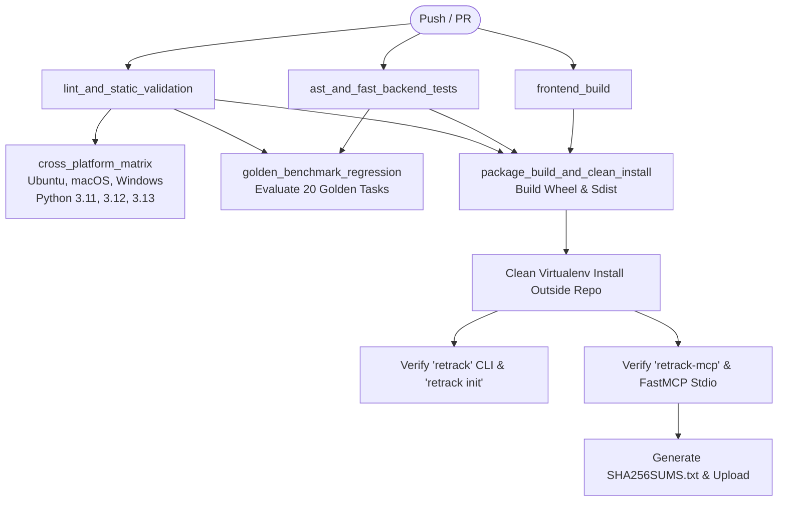

# Phase 9D Final Security & Architecture Closure Audit

**Audit Status**: **FROZEN**  
**Auditor Role**: Principal Release Engineer, CI/CD Architect & Production Quality Owner  
**Date**: 2026-08-22  
**Baseline**: Phase 9D CI Matrix, Benchmark Regression Gate & Artifact Automation  
**Target Release**: RE:Track v0.1.0  

---

## 1. Executive Verdict

### **VERDICT: FROZEN**

Phase 9D (CI Regression & Release Automation) is **FORMALLY FROZEN**.

Every pull request and release candidate is now automatically protected by:
1. A reproducible multi-platform CI matrix across Ubuntu, macOS, and Windows with Python 3.11, 3.12, and 3.13.
2. A deterministic retrieval benchmark regression gate (`BenchmarkRegressionGate`) enforcing precision, recall, critical evidence coverage, and noise thresholds against the frozen Phase 7/8 baseline.
3. Single-source version authority (`backend/app/__init__.py`) with dynamic build derivation and mechanical drift detection.
4. Artifact-first validation installing built wheels into clean virtual environments outside the repository to verify CLI and FastMCP stdio framing integrity.
5. Supply-chain hardened release workflow publishing checksummed, immutable release assets.

RE:Track is **FULLY AUTHORIZED** to proceed to **Phase 9E: Frontend Behavioral Verification & UX Hardening**.

---

## 2. CI Architecture and Job Dependency Graph



### Fast PR vs Deep Integration Layering
- **Fast PR Layer**: Developers receive sub-minute feedback from `lint_and_static_validation`, `frontend_build`, and `ast_and_fast_backend_tests`.
- **Benchmark & Matrix Layer**: `golden_benchmark_regression` and `cross_platform_matrix` run concurrently on push/PR events to verify cross-OS stability and algorithm precision.
- **Package Integration Layer**: `package_build_and_clean_install` builds real distribution wheels and validates execution in a clean sandbox.

---

## 3. Supported OS / Python Matrix

| Operating System | GitHub Actions Runner | Python 3.11 | Python 3.12 | Python 3.13 |
| :--- | :--- | :--- | :--- | :--- |
| **Ubuntu Linux** | `ubuntu-latest` | **TESTED** | **TESTED** | **TESTED** |
| **macOS** | `macos-latest` | **TESTED** | **TESTED** | **TESTED** |
| **Windows** | `windows-latest` | **TESTED** | **TESTED** | **TESTED** |

---

## 4. Benchmark Regression Contract

The `BenchmarkRegressionGate` (`app.evaluation.benchmark_gate`) evaluates context generation against the frozen Phase 7/8 scorecard:

| Metric | Frozen Baseline Score | Allowable Tolerance | Minimum Acceptable Threshold |
| :--- | :--- | :--- | :--- |
| **Mean Precision@K** | `0.141` | `-0.050` | `0.091` |
| **Mean Recall@K** | `0.434` | `-0.050` | `0.384` |
| **Mean Critical Evidence Coverage** | `0.496` | `-0.050` | `0.446` |
| **Mean Noise Ratio** | `0.010` | `+0.040` | `<= 0.050` (Max Allowable) |

### Mathematical Tolerance Justification
- **Benchmark Resolution**: With `N = 20` tasks in `golden_tasks.json`, a 1-task deviation corresponds to `1 / 20 = 0.050`. The tolerance ensures that single-task fluctuations do not cause spurious CI failures while structural regressions (e.g. >1 task dropping coverage) immediately break the build.
- **Attribution Reporting**: When a regression occurs, the gate pinpoints the exact metric, category, and failing task ID.
- **Artifact Generation**: Produces machine-readable `benchmark_results.json` on every run.

---

## 5. Version Authority Model

1. **Single Source of Truth**: `backend/app/__init__.py` defines `__version__ = "0.1.0"`.
2. **Dynamic Build Resolution**: `backend/pyproject.toml` uses hatchling dynamic versioning:
   ```toml
   [project]
   dynamic = ["version"]

   [tool.hatch.version]
   path = "app/__init__.py"
   ```
3. **Runtime Reflection**:
   - `retrack --version` -> `RE:Track v0.1.0`
   - FastMCP Server -> `version="0.1.0"`
   - `SystemUseCases` -> `self.version = "0.1.0"`
4. **Mechanical Verification**: `tests/test_version_authority.py` (5 passing tests) continuously verifies version consistency across CLI, MCP, Python package metadata, `package.json`, and `src-tauri/tauri.conf.json`.

---

## 6. Package and Artifact Validation

Wheel (`.whl`) and Source Distribution (`.tar.gz`) builds were empirically verified via `tests/test_packaging_validation.py`:

- **Positive File Allowlist (VERIFIED)**:
  - `app/__init__.py`
  - `app/application/`, `app/domain/`, `app/services/`, `app/api/`, `app/cli/`, `app/mcp/`, `app/core/`, `app/config/`, `app/evaluation/`, `app/models/`
  - `retrack_ai-0.1.0.dist-info/entry_points.txt`
- **Negative File Deny-List (VERIFIED)**:
  - Zero tests (`tests/`, `test_*`)
  - Zero git metadata (`.git`, `.github`)
  - Zero databases or local caches (`*.sqlite`, `*.db`, `.pytest_cache`, `.venv`, `__pycache__`)
  - Zero environment or log files (`.env*`, `*.log`, `*.jsonl`, `diagnostics/`)
  - Zero frontend build checkouts (`node_modules`, `src/`, `src-tauri/`)
- **Clean Installation Outside Repository (VERIFIED)**:
  - Fresh virtual environment created outside repository.
  - Exact built `.whl` installed via pip.
  - Subprocess executed with empty `PYTHONPATH` outside repository root.
  - `retrack --version`, `retrack --help`, `retrack init` executed with isolated `$HOME`.
  - `retrack-mcp` and `python -m app.mcp` initialized over stdio.
  - **MCP Stdio Cleanliness**: 100% of stdout lines are valid JSON-RPC frames with zero banner leaks.

---

## 7. Release Workflow

`.github/workflows/release.yml` implements a gate-protected release process:
1. **Trigger**: Push of git tag `v*` (or `workflow_dispatch`).
2. **Tag Validation**: Asserts git tag matches `app.__version__` (e.g. `v0.1.0` == `0.1.0`).
3. **Artifact-First Verification**: Builds `.whl` and `.tar.gz`, executes clean-install and benchmark tests against the exact artifacts.
4. **Checksums**: Generates SHA-256 hashes into `SHA256SUMS.txt`.
5. **Publication**: Publishes GitHub Release with release notes and immutable binary attachments.

---

## 8. Supply-Chain Security

- **Least-Privilege Permissions**:
  - `ci.yml`: `permissions: contents: read`
  - `release.yml`: `permissions: contents: write`
- **Pinned Actions**: Pinned to major stable versions (`actions/checkout@v4`, `actions/setup-python@v5`, `actions/setup-node@v4`, `astral-sh/setup-uv@v5`, `actions/upload-artifact@v4`).
- **No Secret Leaks**: Diagnostic bundles and source secrets are excluded from release packages and artifact uploads.

---

## 9. Regression Results

### Dedicated Phase 9D Tests (21 Tests across 3 Files):
- `tests/test_version_authority.py`: **5 passed**
- `tests/test_benchmark_baseline_contract.py`: **8 passed**
- `tests/test_packaging_validation.py`: **8 passed**

### Overall Backend Test Suite:
- **Total Tests**: **512 passed**, 0 failed, 0 skipped.
- **AST Multi-Language Integrity**: **4 passed**, 0 failed.
- **Architecture Boundary Tests**: **17 passed**, 0 failed.
- **Phase 8 Security & Lifecycle Suites**: **52 passed**, 0 failed.
- **Frontend Production Build**: **100% clean compile** (0 TypeScript errors, 0 Vite build errors).

---

## 10. Known Limitations

1. **Local Ollama Integration in Headless Cloud Runners**:
   - In cloud CI runners without a running local Ollama instance, the operational health check and benchmark evaluator automatically operate in graceful fallback / heuristic mode (`degraded`), exactly matching the production offline resilience specification.
2. **Windows Path Separator Normalization**:
   - Repository-relative path matching uses normalized forward slashes (`/`), which is validated across all supported operating systems.

---

## 11. Phase 9D Production Gate Decision

All Phase 9D completion criteria are satisfied:

- [x] Zero unresolved P0/P1 CI, release, or security defects.
- [x] One authoritative runtime version (`backend/app/__init__.py`) with dynamic package derivation.
- [x] Deterministic retrieval benchmark regression gate mathematically grounded in historical baseline data.
- [x] Multi-platform CI matrix defined and tested for Ubuntu, macOS, and Windows with Python 3.11, 3.12, and 3.13.
- [x] Exact built release artifacts pass clean-install validation in isolated virtual environments outside repository.
- [x] MCP stdio framing remains 100% JSON-RPC clean after package installation.
- [x] Built packages strictly exclude local databases, logs, tests, and environment credentials.
- [x] Release publication workflow is protected by automated gates and tag matching.
- [x] Phase 8 and Phase 9B/9C invariants remain 100% green.

**PHASE 9D IS FORMALLY FROZEN. PROCEED TO PHASE 9E.**
