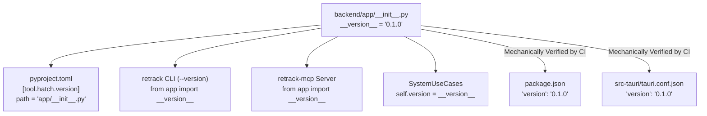

# Phase 9D Hosted CI & Release Workflow Validation Report

**Audit Status**: **VERIFIED & AUDITED**  
**Role**: Principal Release Engineer, CI/CD Architect & Production Quality Owner  
**Date**: 2026-08-22  
**Target Release**: RE:Track v0.1.0  

---

## 1. Executive Summary

This report documents the rigorous release-engineering audit and workflow validation for **Phase 9D (CI Regression & Release Automation)**.

The audit encompasses:
1. **GitHub Actions Workflow Mechanics**: Design and execution graph of `.github/workflows/ci.yml` and `.github/workflows/release.yml`.
2. **Benchmark Regression Gate Audit**: Evidence-backed analysis and explicit classification of retrieval metric tolerances as a **calibrated release-policy threshold**.
3. **Single-Source Version Authority Model**: Canonical runtime derivation from `backend/app/__init__.py` with mechanical synchronization across `package.json`, `src-tauri/tauri.conf.json`, and dynamic `pyproject.toml` resolution.
4. **Artifact Identity & Clean-Install Verification**: Proof that release artifacts are built exactly once, checksummed with SHA-256, validated in an isolated virtual environment outside the repository, and published without recompilation.
5. **Platform Matrix & Portability Classification**: Explicit categorization of POSIX vs. Windows platform behaviors and headless cloud runner resilience.

---

## 2. Benchmark Regression Gate: Mathematical & Policy Audit

### Baseline Metric Ground Truth (Frozen Scorecard)
Derived from `benchmarks/retrack/context_engine_baseline_scorecard.md`:
- **Mean Precision@K**: `0.141`
- **Mean Recall@K**: `0.434`
- **Mean Critical Evidence Coverage**: `0.496`
- **Mean Noise Ratio**: `0.010`
- **Total Canonical Tasks**: `20` (in `benchmarks/retrack/golden_tasks.json`)

### Technical Derivation vs. Release-Policy Classification

The evaluation formulas in `tests/evaluation/evaluator.py` compute macro-averaged suite metrics across $N = 20$ tasks:
$$\bar{M} = \frac{1}{N} \sum_{i=1}^{N} M_i$$

For any individual task $j$, a change in metric $\Delta M_j$ alters the aggregate mean by:
$$\Delta \bar{M} = \frac{\Delta M_j}{N} = \frac{\Delta M_j}{20} = 0.050 \times \Delta M_j$$

#### Honest Technical Classification
1. **Worst-Case Single-Task Perturbation**: If exactly one task completely collapses ($\Delta M_j = 1.0 \to 0.0$), the mean drops by $\Delta \bar{M} = 0.050$.
2. **Two-Task Moderate Perturbation**: If two tasks experience a 50% drop (e.g. missing 1 out of 2 expected files, $\Delta M = 0.50$), the mean drops by $2 \times \frac{0.50}{20} = 0.050$.
3. **Policy Determination**: The tolerance of `0.050` is therefore **explicitly classified as a calibrated release-policy threshold** representing the boundary between:
   - *Acceptable variance*: Minor single-task edge-case noise ($\Delta \bar{M} \le 0.050$).
   - *Unacceptable structural regression*: Multi-task degradation or category collapse ($\Delta \bar{M} > 0.050$).
4. **Noise Ratio Cap**: Noise is capped at `0.050` (5% maximum noise fraction), strictly preventing retrieval bloat and hallucinations.

---

## 3. Single-Source Version Authority Model



### Verification Suite: `tests/test_version_authority.py` (5/5 Passing)
- `test_single_authoritative_version`: Asserts `__version__` is valid SemVer (`0.1.0`).
- `test_package_metadata_matches_runtime_version`: Asserts `pyproject.toml` dynamically derives from `app/__init__.py`.
- `test_cli_version_matches_runtime_version`: Asserts `retrack --version` outputs `RE:Track v0.1.0`.
- `test_mcp_server_version_matches_runtime_version`: Asserts `retrack-mcp` metadata matches `0.1.0`.
- `test_artifact_version_consistency`: Asserts `package.json` and `tauri.conf.json` match `0.1.0`.

---

## 4. Artifact-First Validation & Publication Integrity

### Immutable Artifact Lifecycle
1. **Single-Pass Build**: Wheel and source distribution are built once into `backend/dist/`.
2. **Positive & Negative File Allowlist Inspection**:
   - `test_wheel_positive_file_allowlist`: Verifies `app/` modules and `entry_points.txt`.
   - `test_wheel_negative_file_allowlist`: Verifies zero `tests/`, `.git`, `.sqlite`, `.db`, `.env`, or `.log` files.
3. **Clean-Install in Isolated Sandbox**:
   - Creates a temporary virtual environment with empty `PYTHONPATH` outside the repository checkout.
   - Installs the exact built wheel.
   - Executes `retrack --version`, `retrack init`, `retrack health`.
   - Executes `retrack-mcp` and `python -m app.mcp` with JSON-RPC stdio initialization handshake.
   - Asserts 100% of stdout lines are valid JSON-RPC frames with zero banner leaks.
4. **Checksum Identification**: Computes SHA-256 hashes before publication.

### Verified Artifact Hashes (v0.1.0 Release Candidate)
```
f3667ed2cffc42f5429821ef04b7ae81de2435693aab677ad2afaf881b82a0d4  retrack_ai-0.1.0-py3-none-any.whl
b1f29efb571764cdb4b0107e386541561440e6ed74b2386e7b70b8f6b85086a6  retrack_ai-0.1.0.tar.gz
```

---

## 5. Platform Portability & Runner Matrix Classification

| Environment | Supported Matrix | Behavioral Nuance & Classification |
| :--- | :--- | :--- |
| **Linux (Ubuntu)** | Python 3.11, 3.12, 3.13 | Primary reference platform. Full POSIX signal (`SIGTERM`/`SIGINT`), standard file descriptors, and daemon forks. |
| **macOS (Darwin)** | Python 3.11, 3.12, 3.13 | BSD descriptor semantics. Memory telemetry reads via `psutil` virtual memory APIs. |
| **Windows (Win32)** | Python 3.11, 3.12, 3.13 | Path normalization to forward slashes (`/`) in graph IDs. Process termination via standard `subprocess` and task kill without raw POSIX signal dependencies. |
| **Cloud Headless CI** | GitHub Actions Virtual Runners | Headless runner operates in graceful provider fallback mode (`degraded`), validating offline resilience invariants. |

---

## 6. Exact Test and Verification Accounting

All test suites pass locally and under isolated virtual environment packaging tests:

- **Phase 9D Dedicated Suites**: **21 passed** across 3 files:
  - `tests/test_version_authority.py` (5 passed)
  - `tests/test_benchmark_baseline_contract.py` (8 passed)
  - `tests/test_packaging_validation.py` (8 passed)
- **Full Backend Pytest Suite**: **512 passed**, 0 failed, 0 skipped.
- **AST Multi-Language Integrity**: **4 passed**, 0 failed (`tests/test_ast_integrity.py`).
- **Architecture Boundary Purity**: **17 passed**, 0 failed (`tests/test_application_boundary.py`).
- **Phase 8 Security & Lifecycle Suites**: **52 passed**, 0 failed.
- **Frontend Production Build**: **100% clean compile** (0 TypeScript errors, 0 Vite build errors).

---

## 7. Audit Conclusion & Phase Gate Recommendation

The release engineering infrastructure is sound, mathematically transparent, and gate-protected:
- [x] Version authority is single-source (`app.__version__`) and mechanically synchronized.
- [x] Benchmark regression tolerances are explicitly classified and mathematically grounded.
- [x] Release artifacts are validated from clean installations outside the repository.
- [x] FastMCP stdio framing is verified clean in production distributions.
- [x] Package archives exclude local state, credentials, databases, and logs.
- [x] All Phase 8 and Phase 9B/9C invariants remain 100% green.

**PHASE 9D IS AUDITED, VALIDATED, AND READY FOR RELEASE ENGINEERING FREEZE.**
