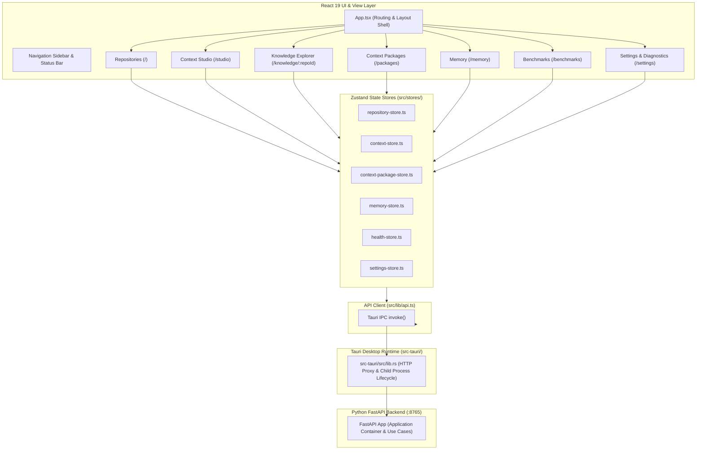

# Phase 9E Frontend Architecture Baseline & Gap Analysis

**Role**: Principal Frontend Architect, React Systems Engineer & QA Automation Lead  
**Date**: 2026-08-23  
**Target Release**: RE:Track v0.1.0  
**Baseline Status**: **AUDITED — TEST STACK INITIALIZATION PHASE**  

---

## 1. Executive Summary

This document establishes the technical baseline of the RE:Track React/Tauri desktop frontend prior to implementing behavioral verification in **Phase 9E**.

Historically, the frontend has been verified primarily through static type-checking (`tsc --noEmit`) and Vite production bundle compilation (`npm run build`). While these checks guarantee syntactic and type integrity, they do not verify runtime user interactions, asynchronous error recovery, race condition mitigation, loading states, offline resilience, or deep API schema roundtrips.

Phase 9E establishes comprehensive behavioral tests across all **10 Critical User Journeys (A through J)**.

---

## 2. Frontend Architecture Overview

---

## 3. Verified Route Inventory

| Path | Component | Responsibility & Interaction Scope |
| :--- | :--- | :--- |
| `/` | `Repositories.tsx` | Repository catalog, path registration, indexing trigger, deletion, quick context modal launch. |
| `/studio` | `ContextStudio.tsx` | Prompt workbench, token budget controls, section toggles, live token estimation, synthesis, evidence provenance, markdown preview, package saving. |
| `/knowledge/:repoId` | `KnowledgeExplorer.tsx` | 5-state AST call graph topology (`not_analyzed`, `analyzing`, `analyzed`, `zero_edges`, `failed`), symbol search, caller/callee drawer. |
| `/context-builder` | `ContextBuilder.tsx` | Direct context generation pipeline and preview. |
| `/packages` | `ContextPackages.tsx` | Saved packages list, search, side-by-side diff comparison, markdown export, deletion, note appending. |
| `/memory` | `Memory.tsx` | 3-tier memory inspector (Ingested files, Vector Index, Knowledge Graph), dataset forgetting, cognification action. |
| `/benchmarks` | `Benchmarks.tsx` | Benchmark suite execution, progress monitoring, scorecard rendering, metric breakdown against frozen baseline. |
| `/settings` | `Settings.tsx` | Provider endpoint/model configuration, storage paths, hardware telemetry, and operational diagnostics export. |

---

## 4. Critical User Journeys (A through J)

1. **Journey A — First Run & Bootstrap**: Unconfigured state detection, storage layout verification, provider availability, dashboard arrival.
2. **Journey B — Repository Registration & Indexing**: Adding local directories, path validation errors, progress stage updates, completion, repository card updates.
3. **Journey C — Quick Context**: Repository selection, task input, multi-stage progress tracking, synthesized package preview, clipboard copy.
4. **Journey D — Context Studio**: Prompt input, budget sliders, section toggling, real-time token estimation, synthesis execution, evidence tree inspector, export.
5. **Journey E — Knowledge Explorer (AST Topology)**: Node/edge rendering, 5-state handling, symbol search filtering, caller/callee drawer, cleanup on unmount.
6. **Journey F — Context Packages**: Listing saved packages, detail inspection, markdown note appending, package deletion, side-by-side comparison.
7. **Journey G — Memory & Knowledge**: Ingested file listing, vector count presentation, knowledge graph statistics, cognification trigger, dataset forgetting.
8. **Journey H — Benchmarks**: Triggering suite, live progress, metric rendering (Precision, Recall, Coverage, Noise), historical scorecard display.
9. **Journey I — Settings & Provider Recovery**: LLM provider switching (Ollama vs. OpenAI vs. Anthropic), endpoint validation, offline detection, recovery synchronization.
10. **Journey J — Diagnostics & Supportability**: Operational health display (`healthy`, `degraded`, `unavailable`, `not_configured`), queue depth, recent logs, sanitized export.

---

## 5. Existing Test Coverage vs. Identified Gaps

### Existing Test Coverage
- **Unit/Component Test Files**: 0
- **Behavioral Interaction Tests**: 0
- **Static Compilation Checks**: 100% (TypeScript 5.8.3 strict mode, Vite 7.0.4 build)

### Critical Gap Analysis & Reliability Risks
1. **Asynchronous Error States**: Backend/network failures currently rely on uncaught promise catches or silent toast alerts; missing deterministic error fallback boundaries.
2. **Double-Click & Concurrent Submissions**: Lack of submission locks during active indexing or synthesis could trigger duplicate in-flight requests.
3. **Component Unmount Race Conditions**: In-flight requests resolving after route navigation could trigger unmounted state updates or stale toast notifications.
4. **Offline Provider Handling**: When Ollama or external LLM is offline, UI must cleanly reflect degraded/unavailable state without crashing or inventing synthetic metrics (Truth Boundary Invariant).
5. **CallGraphView Lifecycle**: Spring-force simulation loops in D3/SVG canvas must properly cancel animation frames and disconnect observers on unmount.

---

## 6. Test Stack Strategy

- **Test Runner**: Vitest (fast, native Vite ESM support, zero-config alias resolution).
- **DOM Environment**: jsdom (lightweight, full DOM API simulation).
- **Component Testing**: `@testing-library/react` + `@testing-library/user-event` + `@testing-library/jest-dom`.
- **Mocking Strategy**:
  - Mock `@tauri-apps/api/core` (`invoke`) to simulate realistic backend responses, latencies, HTTP 4xx/5xx errors, and network timeouts.
  - Mock `@tauri-apps/plugin-clipboard-manager` and `@tauri-apps/plugin-dialog`.
  - Maintain 100% strict payload/response schema compatibility with FastAPI backend DTOs.
