# RE:Track — Architectural Refactoring Roadmap

> **Document Status**: Proposed Roadmap (Phase 0 Baseline)  
> **Date**: 2026-08-20  
> **Scope**: Planned evolution from monolithic command layer to Clean Architecture / Hexagonal Ports & Adapters.  
> **Constraint**: Do NOT execute any phase until explicitly approved.

---

## Roadmap Overview

```mermaid
flowchart LR
    P0[Phase 0: Baseline & Audit] --> P1[Phase 1: Application Boundary]
    P1 --> P2[Phase 2: Core Engine Extraction]
    P2 --> P3[Phase 3: Ports & Adapters]
    P3 --> P4[Phase 4: Standalone CLI]
    P4 --> P5[Phase 5: FastAPI Adapter]
    P5 --> P6[Phase 6: GUI Interface Sync]
    P6 --> P7[Phase 7: MCP Server Integration]
    P7 --> P8[Phase 8: Optional TUI]
    P8 --> P9[Phase 9: Hierarchical Caching]
```

---

## Phase 1: Application & Use-Case Boundary

> **Status**: Completed (2026-08-20) — 304 backend unit & boundary tests passing.

### Objective
Decompose the 2,158-line monolithic `app.api.commands` module into explicit, cohesive Application Use Cases without altering public API contracts or external behavior.

### Affected Components
- `backend/app/api/commands.py` (Decomposed into clean delegation facade)
- `backend/app/application/` (New package: use cases with constructor injection + `container.py` composition root)
- `backend/app/server.py` (Updated to call use case interactors / facade cleanly)
- `backend/tests/test_application_boundary.py` (New boundary tests + AST static architectural verification)

### Migration Strategy
1. Created `app/application/use_cases/` directory.
2. Extracted self-contained use case classes with constructor dependency injection:
   - `ContextUseCases` (`generate_context`, `get_agent_context`)
   - `IndexingUseCases` (`index_repository`, `get_repository_summaries`)
   - `RepositoryUseCases` (`list_repositories`, `create_repository`, `scan_repository`, `delete_repository`, `generate_suggested_prompts`)
   - `MemoryUseCases` (`list_datasets`, `get_dataset_items`, `forget_dataset`, `cognify_dataset`, `get_memory_stats`, `get_memory_graph`, `get_memory_vectors`, `get_dashboard_stats`)
   - `PackageUseCases` (`save_context_package`, `list_context_packages`, `get_context_package`, `delete_context_package`, `append_context_package`)
   - `SystemUseCases` (`health`, `get_backend_status`, `get_app_settings`, `update_cognee_settings`, `update_provider`)
   - `BenchmarkUseCases` (`run_benchmark`)
3. Implemented `ApplicationContainer` in `app/application/container.py` as composition root.
4. Maintained thin compatibility facade in `commands.py` with mock synchronization for existing test suites.

### Risks Handled
- Zero serialization or error format changes.
- Concurrency locks (`_indexing_lock`, `_context_gen_lock`) preserved and held in application container.

### Acceptance Criteria
- [x] Monolithic logic removed from `commands.py`; functions act as pure delegation to explicit use cases.
- [x] 100% of existing backend pytest test suite (295 tests) passes unchanged.
- [x] 9 new boundary and AST static purity tests pass in `test_application_boundary.py` (total: 304 passed).
- [x] Concurrency locking and error handling semantics strictly preserved.

---

## Phase 2: Application Layer Independence & Core Boundary Stabilization

> **Status**: Completed (2026-08-20) — 307 backend tests passing, 0 AST boundary violations, frontend build 100% clean.

### Objective
Make `app.application` genuinely independent of `app.api`, `FastAPI`, `app.server`, `app.cli`, and direct persistence I/O, establishing an application-owned DTO contract and explicit domain service dependencies.

### Affected Components
- `backend/app/application/dto/` (New package: `common.py`, `context.py`, `indexing.py`, `repositories.py`, `memory.py`, `packages.py`, `system.py`, `benchmarks.py`)
- `backend/app/api/schemas.py` (Refactored to re-export from `app.application.dto`)
- `backend/app/services/repository_metadata_store.py` (New: `RepositoryMetadataStore` protocol + `JsonRepositoryMetadataStore`)
- `backend/app/services/source_search_service.py` (New: `SourceSearchService` for file filtering & snippet extraction)
- `backend/app/services/benchmark_service.py` (New: `BenchmarkService` with constructor DI)
- `backend/app/services/context_service.py` (Extended to accept dynamic `repository_summary` and `target_tokens`)
- `backend/app/application/use_cases/` (All 7 use cases updated to use application DTOs and injected services)
- `backend/app/application/container.py` (Updated to wire new services; removed all `app.api` imports)
- `backend/tests/test_application_boundary.py` (Strengthened with AST import purity and persistence checks)

### Migration Strategy
1. Created `app/application/dto/` package owning all request/response data contracts.
2. Refactored `app/api/schemas.py` as a backward-compatibility facade re-exporting application DTOs.
3. Created `RepositoryMetadataStore` protocol and `JsonRepositoryMetadataStore` implementation; removed raw filesystem I/O from `IndexingUseCases`, `RepositoryUseCases`, and `MemoryUseCases`.
4. Extracted low-level source searching and snippet slicing from `ContextUseCases.get_agent_context()` into `SourceSearchService`.
5. Updated `ContextService.generate_context_package` to accept optional overrides, eliminating inline `ContextService(...)` construction.
6. Relocated benchmark execution logic to `app/services/benchmark_service.py`, eliminating `app.api.benchmarks` dependency from `container.py`.
7. Strengthened AST boundary tests to strictly forbid `app.api`, `fastapi`, `starlette`, `app.server`, `app.cli`, `kuzu`, `lancedb`, and `cognee.api.v1` in `app/application/`.

### Acceptance Criteria
- [x] `app.application` contains 0 imports from `app.api`, `fastapi`, `starlette`, `app.server`, `app.cli`.
- [x] Application layer owns all DTO contracts under `app.application.dto`.
- [x] No use case performs direct JSON file I/O or accesses `~/.retrack/indexed_repos.json` directly.
- [x] No use case constructs infrastructure services inline during execution.
- [x] Core benchmark execution is moved out of the API adapter layer into `app.services.benchmark_service`.
- [x] 100% of backend tests pass (307 passed, 2 skipped, 0 failed).
- [x] All 12 boundary tests pass in `test_application_boundary.py`.
- [x] Frontend production build succeeds (`npm run build`).

---

## Phase 3: Infrastructure Ports & Adapters (Completed)

### Objective
Define explicit abstraction interfaces (Ports) for all external systems (Memory/Vector/Graph store, LLM Inference, Structural Code Graph CLI, Filesystem persistence, Telemetry) and decouple Use Cases from concrete service implementations.

### Affected Components
- `backend/app/application/domain/repository.py` (New: `IndexedRepositoryRecord` domain entity)
- `backend/app/application/ports/` (New: `FileSystemPort`, `RepositoryMetadataPort`, `MemoryPort`, `SourceSearchPort`, `ContextServicePort`, `IndexingServicePort`, `RepositoryManagerPort`, `LLMProviderPort`, `ContextPackageRepositoryPort`, `CGCServicePort`, `IntentParserPort`, `SummaryGeneratorPort`, `ContextCachePort`, `HardwareTelemetryPort`, `BenchmarkRunnerPort`)
- `backend/app/services/local_filesystem.py` (New: `LocalFileSystemAdapter` implementing `FileSystemPort`)
- `backend/app/services/hardware_telemetry.py` (New: `LocalHardwareTelemetryAdapter` implementing `HardwareTelemetryPort`)
- `backend/app/services/repository_metadata_store.py` (Updated to implement `RepositoryMetadataPort` with typed `IndexedRepositoryRecord`)
- `backend/app/services/source_search_service.py` (Updated to use injected `FileSystemPort`)
- `backend/app/application/use_cases/` (All 7 use cases refactored to depend on ports; 0 imports of `app.services`)
- `backend/app/application/container.py` (Wires adapters to ports at composition root)
- `backend/tests/test_application_boundary.py` (Expanded with port AST purity, domain entity roundtrip, adapter contract tests)

### Migration Strategy
1. Defined typed `IndexedRepositoryRecord` domain entity in `app.application.domain.repository.py`.
2. Created Python `Protocol` ports under `app.application.ports/`.
3. Created `LocalFileSystemAdapter` and `LocalHardwareTelemetryAdapter` in `app.services/`.
4. Refactored `JsonRepositoryMetadataStore` to implement `RepositoryMetadataPort` using `IndexedRepositoryRecord`.
5. Refactored all seven use-case constructors to receive capability ports rather than concrete service classes.
6. Updated `ApplicationContainer` to construct adapters and wire them into use cases.
7. Validated strict AST purity enforcing zero `app.services` imports across `use_cases/`, `ports/`, and `domain/`.

### Acceptance Criteria
- [x] Core domain and use cases depend exclusively on `app.application.ports` and never import `app.services` or concrete adapters.
- [x] Typed `IndexedRepositoryRecord` entity eliminates untyped dictionary leakage across metadata operations.
- [x] Filesystem operations and hardware telemetry are encapsulated behind `FileSystemPort` and `HardwareTelemetryPort`.
- [x] In-memory mock/fake port adapters can be instantiated for fast testing without running live external databases.
- [x] 100% backend tests pass (313 passed, 2 skipped, 0 failed).
- [x] 100% AST architectural boundary tests pass (18 passed).
- [x] Frontend production build succeeds (`npm run build`).

---

## Phase 4: Storage Compatibility & DEBT-004 Packaging Cleanup (Completed)

> **Status**: Completed (2026-08-21) — 327 backend tests passing, 14 dedicated storage compatibility tests passing, 0 framework leaks on service import.

### Objective
Standardize all persistence adapters around a non-negotiable dual-path architecture where `~/.retrack/` is canonical writable storage and `~/.andes/` is strictly read-only legacy fallback. Resolve DEBT-004 to eliminate eager framework loading from `app.services`.

### Affected Components
- `backend/app/services/repository_metadata_store.py` (Dual-path + atomic writes with fsync)
- `backend/app/services/repository_manager.py` (Dual-path + clone workspace isolation + atomic writes)
- `backend/app/services/context_package_repository.py` (Dual-path + atomic writes)
- `backend/app/config/settings.py` (Dual-path settings store + atomic writes)
- `backend/app/services/manifest_service.py` (Dual-path manifests + atomic writes)
- `backend/app/application/use_cases/context.py` (Dual-path repo-local manifest check)
- `backend/app/services/__init__.py` (Resolved DEBT-004 using lazy `__getattr__` exports)
- `backend/tests/test_storage_compatibility.py` (Dedicated comprehensive regression test suite)

### Migration Strategy
1. Implemented canonical-first reads and legacy fallbacks across all 5 JSON persistence adapters.
2. Enforced write exclusivity: all new writes target `~/.retrack/` only; legacy `~/.andes/` is never mutated, deleted, or renamed.
3. Implemented atomic file writes with `.tmp` staging and `os.fsync`.
4. Guaranteed clone safety: new clones target `~/.retrack/repos/`; existing legacy clones in `~/.andes/repos/` are treated as read-only inspection targets.
5. Replaced eager imports in `app/services/__init__.py` with dynamic `__getattr__` resolution.
6. Added 14 dedicated regression tests covering Scenarios A–I with SHA256 immutability assertions.

### Acceptance Criteria
- [x] `~/.retrack/` is canonical writable storage; `~/.andes/` is strictly read-only fallback.
- [x] Reading legacy files produces 0 write-backs or modifications (verified by SHA256 before/after checks).
- [x] Legacy clones remain usable and are never mutated by scan/indexing operations.
- [x] DEBT-004 resolved: `import app.services` does not load `fastapi`, `cognee`, or `starlette`.
- [x] 100% backend tests pass (327 passed, 2 skipped, 0 failed).
- [x] 100% boundary tests pass (18 passed).
- [x] 100% AST integrity tests pass (4 passed).
- [x] Frontend production build succeeds (`npm run build`).

---

## Phase 5: Domain Model & Port Refinement (Completed)

### Objective
Resolve deferred architectural debts (DEBT-005, DEBT-006, DEBT-007) by segmenting `MemoryPort` into cohesive capability protocols, typing repository metadata substructures, and extracting a pure heuristic intent parsing domain entity.

### Affected Components
- `backend/app/application/domain/repository.py` (New: `ArchitectureLayerRecord`, `ComponentRecord`; typed `IndexedRepositoryRecord`)
- `backend/app/application/domain/intent.py` (New: `ParsedIntentRecord`, pure `parse_intent_heuristics`)
- `backend/app/application/domain/memory.py` (New: `MemoryDatasetRecord`, `MemoryDataItemRecord`, `MemoryGraphNodeRecord`, `MemoryGraphEdgeRecord`, `MemoryGraphRecord`, `MemoryVectorStatsRecord`)
- `backend/app/application/ports/memory.py` (Decomposed: `MemoryLifecyclePort`, `MemoryIngestionPort`, `MemoryRetrievalPort`, `MemoryDatasetPort`, `MemoryTopologyPort`, `MemoryPort`)
- `backend/app/application/ports/intent_parser.py` (Cleaned Protocol interface returning `ParsedIntentRecord`)
- `backend/app/application/use_cases/` (`system.py`, `repositories.py`, `indexing.py`, `context.py`, `memory.py` adapted to narrow capability ports and typed records)
- `backend/app/services/intent_parser.py` (Delegates to domain `parse_intent_heuristics`)
- `backend/tests/test_domain_refinement.py` (New: 15 dedicated Phase 5 tests)

### Migration Strategy
1. Defined `ArchitectureLayerRecord` and `ComponentRecord` domain models; updated `IndexedRepositoryRecord` with backward-compatible `from_dict()` / `to_dict()`.
2. Created `ParsedIntentRecord` and pure domain function `parse_intent_heuristics(prompt)`; cleaned `IntentParserPort` protocol and eliminated duplicate private fallback from `ContextUseCases`.
3. Created typed memory domain models (`MemoryDatasetRecord`, `MemoryDataItemRecord`, etc.) and decomposed `MemoryPort` into 5 cohesive capability protocols.
4. Refactored use cases to consume narrowest capability ports (`SystemUseCases` $\to$ `MemoryLifecyclePort`, `RepositoryUseCases` $\to$ `MemoryDatasetPort`).
5. Verified 100% backward compatibility for historical JSON and dual-path fallback.

### Acceptance Criteria
- [x] DEBT-005 resolved: `MemoryPort` split into 5 capability protocols; typed memory domain records created.
- [x] DEBT-006 resolved: `IndexedRepositoryRecord` substructures typed; 100% backward compatible with historical JSON.
- [x] DEBT-007 resolved: Pure `parse_intent_heuristics` extracted; `IntentParserPort` cleaned.
- [x] 100% of backend tests pass (342 passed, 2 skipped, 0 failed).
- [x] 100% boundary tests pass (18 passed).
- [x] 100% AST integrity tests pass (4 passed).
- [x] 100% storage compatibility tests pass (14 passed).
- [x] 100% Phase 5 domain refinement tests pass (15 passed).
- [x] Frontend production build succeeds (`npm run build`).

---

## Phase 6: FastAPI Route Modularization & Ingress Adapter Cleanup

### Objective
Align frontend stores and Tauri bridge directly with the cleaned API schema contracts and streamline backend lifecycle management.

### Affected Components
- `src-tauri/src/lib.rs`
- `src/lib/api.ts`
- `src/stores/*.ts`

### Migration Strategy
1. Audit all 25 endpoint invocations in `src/lib/api.ts`.
2. Standardize error handling and eliminate any lingering legacy endpoints.
3. Verify that the desktop GUI works identically against both the integrated Tauri backend and an external standalone server.

### Risks
- TypeScript type mismatch regressions in Zustand stores.
- Tauri IPC serialization edge cases with large context packages.

### Acceptance Criteria
- [ ] `npm run build` succeeds with zero TypeScript errors.
- [ ] All 5 GUI pages (ContextStudio, KnowledgeExplorer, Repositories, Memory, Benchmarks) function smoothly.

---

## Phase 7: MCP Server Integration

### Objective
Expose RE:Track's context generation, AST call graphs, and memory query capabilities as a Model Context Protocol (MCP) server for external AI coding tools (Antigravity, Cursor, Claude Code).

### Affected Components
- `backend/app/mcp/` (New: MCP server entrypoint and tools)
- `backend/app/mcp/tools.py` (`get_context`, `get_symbol_graph`, `search_memory`, `index_repository`)

### Migration Strategy
1. Implement an MCP server using Python standard `mcp` library / fastmcp over stdio and SSE transports.
2. Directly wire MCP tools to application use cases from Phase 1.
3. Provide configuration instructions and JSON manifest for agent tools.

### Risks
- Stdio process lifecycle collisions when launched by agent environments.
- High memory usage if multiple agent instances trigger concurrent cognify runs.

### Acceptance Criteria
- [ ] MCP server starts via `retrack mcp` or `python -m app.mcp`.
- [ ] Tools `get_context`, `get_symbol_graph`, and `index_repository` return valid structured data.

---

## Phase 8: Optional TUI (Terminal User Interface)

### Objective
Provide a lightweight Textual-based terminal user interface for interactive repository exploration, memory visualization, and context generation without requiring web browser / webview dependencies.

### Affected Components
- `backend/app/tui/` (New: Textual application screens)

### Migration Strategy
1. Build screens using Textual (`RepositoryScreen`, `ContextBuilderScreen`, `MemoryGraphScreen`).
2. Consume application use cases directly.

### Risks
- Terminal capability limitations on Windows/minimal Linux consoles.

### Acceptance Criteria
- [ ] TUI launches via `retrack tui`.
- [ ] Interactive context synthesis and repository browsing work in standard ANSI terminals.

---

## Phase 9: Hierarchical & Deep Context Caching Research

### Objective
Implement multi-tier context caching (AST graph cache $\to$ prompt intent cache $\to$ LLM key-value prefix cache) to achieve sub-millisecond context delivery for repetitive agent loops.

### Affected Components
- `backend/app/services/context_cache.py`
- `backend/app/core/engine/`

### Migration Strategy
1. Research disk-backed LMDB / SQLite caching for structural subgraphs.
2. Introduce prefix-matched context trees compatible with local llama.cpp / Ollama prompt caching.

### Risks
- Cache invalidation complexity during active code editing.

### Acceptance Criteria
- [ ] Context retrieval latency on cached repositories drops below 2ms.
- [ ] Cache invalidation triggers automatically on file change detection.
