# RE:Track — Architectural Refactoring Roadmap

> **Document Status**: Proposed Roadmap (Phase 0 Baseline)  
> **Date**: 2026-08-20  
> **Scope**: Planned evolution from monolithic command layer to Clean Architecture / Hexagonal Ports & Adapters.  
> **Constraint**: Do NOT execute any phase until explicitly approved.

---

## Roadmap Overview

```mermaid
flowchart LR
    P0[Phase 0: Baseline & Audit] --> P1[Phase 1: Application Boundary]
    P1 --> P2[Phase 2: Core Engine Extraction]
    P2 --> P3[Phase 3: Ports & Adapters]
    P3 --> P4[Phase 4: Standalone CLI]
    P4 --> P5[Phase 5: FastAPI Adapter]
    P5 --> P6[Phase 6: GUI Interface Sync]
    P6 --> P7[Phase 7: MCP Server Integration]
    P7 --> P8[Phase 8: Optional TUI]
    P8 --> P9[Phase 9: Hierarchical Caching]
```

---

## Phase 1: Application & Use-Case Boundary

> **Status**: Completed (2026-08-20) — 304 backend unit & boundary tests passing.

### Objective
Decompose the 2,158-line monolithic `app.api.commands` module into explicit, cohesive Application Use Cases without altering public API contracts or external behavior.

### Affected Components
- `backend/app/api/commands.py` (Decomposed into clean delegation facade)
- `backend/app/application/` (New package: use cases with constructor injection + `container.py` composition root)
- `backend/app/server.py` (Updated to call use case interactors / facade cleanly)
- `backend/tests/test_application_boundary.py` (New boundary tests + AST static architectural verification)

### Migration Strategy
1. Created `app/application/use_cases/` directory.
2. Extracted self-contained use case classes with constructor dependency injection:
   - `ContextUseCases` (`generate_context`, `get_agent_context`)
   - `IndexingUseCases` (`index_repository`, `get_repository_summaries`)
   - `RepositoryUseCases` (`list_repositories`, `create_repository`, `scan_repository`, `delete_repository`, `generate_suggested_prompts`)
   - `MemoryUseCases` (`list_datasets`, `get_dataset_items`, `forget_dataset`, `cognify_dataset`, `get_memory_stats`, `get_memory_graph`, `get_memory_vectors`, `get_dashboard_stats`)
   - `PackageUseCases` (`save_context_package`, `list_context_packages`, `get_context_package`, `delete_context_package`, `append_context_package`)
   - `SystemUseCases` (`health`, `get_backend_status`, `get_app_settings`, `update_cognee_settings`, `update_provider`)
   - `BenchmarkUseCases` (`run_benchmark`)
3. Implemented `ApplicationContainer` in `app/application/container.py` as composition root.
4. Maintained thin compatibility facade in `commands.py` with mock synchronization for existing test suites.

### Risks Handled
- Zero serialization or error format changes.
- Concurrency locks (`_indexing_lock`, `_context_gen_lock`) preserved and held in application container.

### Acceptance Criteria
- [x] Monolithic logic removed from `commands.py`; functions act as pure delegation to explicit use cases.
- [x] 100% of existing backend pytest test suite (295 tests) passes unchanged.
- [x] 9 new boundary and AST static purity tests pass in `test_application_boundary.py` (total: 304 passed).
- [x] Concurrency locking and error handling semantics strictly preserved.

---

## Phase 2: Application Layer Independence & Core Boundary Stabilization

> **Status**: Completed (2026-08-20) — 307 backend tests passing, 0 AST boundary violations, frontend build 100% clean.

### Objective
Make `app.application` genuinely independent of `app.api`, `FastAPI`, `app.server`, `app.cli`, and direct persistence I/O, establishing an application-owned DTO contract and explicit domain service dependencies.

### Affected Components
- `backend/app/application/dto/` (New package: `common.py`, `context.py`, `indexing.py`, `repositories.py`, `memory.py`, `packages.py`, `system.py`, `benchmarks.py`)
- `backend/app/api/schemas.py` (Refactored to re-export from `app.application.dto`)
- `backend/app/services/repository_metadata_store.py` (New: `RepositoryMetadataStore` protocol + `JsonRepositoryMetadataStore`)
- `backend/app/services/source_search_service.py` (New: `SourceSearchService` for file filtering & snippet extraction)
- `backend/app/services/benchmark_service.py` (New: `BenchmarkService` with constructor DI)
- `backend/app/services/context_service.py` (Extended to accept dynamic `repository_summary` and `target_tokens`)
- `backend/app/application/use_cases/` (All 7 use cases updated to use application DTOs and injected services)
- `backend/app/application/container.py` (Updated to wire new services; removed all `app.api` imports)
- `backend/tests/test_application_boundary.py` (Strengthened with AST import purity and persistence checks)

### Migration Strategy
1. Created `app/application/dto/` package owning all request/response data contracts.
2. Refactored `app/api/schemas.py` as a backward-compatibility facade re-exporting application DTOs.
3. Created `RepositoryMetadataStore` protocol and `JsonRepositoryMetadataStore` implementation; removed raw filesystem I/O from `IndexingUseCases`, `RepositoryUseCases`, and `MemoryUseCases`.
4. Extracted low-level source searching and snippet slicing from `ContextUseCases.get_agent_context()` into `SourceSearchService`.
5. Updated `ContextService.generate_context_package` to accept optional overrides, eliminating inline `ContextService(...)` construction.
6. Relocated benchmark execution logic to `app/services/benchmark_service.py`, eliminating `app.api.benchmarks` dependency from `container.py`.
7. Strengthened AST boundary tests to strictly forbid `app.api`, `fastapi`, `starlette`, `app.server`, `app.cli`, `kuzu`, `lancedb`, and `cognee.api.v1` in `app/application/`.

### Acceptance Criteria
- [x] `app.application` contains 0 imports from `app.api`, `fastapi`, `starlette`, `app.server`, `app.cli`.
- [x] Application layer owns all DTO contracts under `app.application.dto`.
- [x] No use case performs direct JSON file I/O or accesses `~/.retrack/indexed_repos.json` directly.
- [x] No use case constructs infrastructure services inline during execution.
- [x] Core benchmark execution is moved out of the API adapter layer into `app.services.benchmark_service`.
- [x] 100% of backend tests pass (307 passed, 2 skipped, 0 failed).
- [x] All 12 boundary tests pass in `test_application_boundary.py`.
- [x] Frontend production build succeeds (`npm run build`).

---

## Phase 3: Infrastructure Ports & Adapters

### Objective
Define explicit abstraction interfaces (Ports) for all external systems (Memory/Vector/Graph store, LLM Inference, Structural Code Graph CLI, Filesystem persistence) and move vendor-specific SDK code into Adapters.

### Affected Components
- `backend/app/ports/` (New: `MemoryPort`, `ModelPort`, `StructuralGraphPort`, `RepositoryStorePort`, `PackageStorePort`)
- `backend/app/adapters/memory/cognee_adapter.py` (Extract from `cognee_service.py`)
- `backend/app/adapters/model/openai_adapter.py` (Extract from `llm_provider_service.py`)
- `backend/app/adapters/graph/cgc_adapter.py` (Extract from `cgc_service.py`)
- `backend/app/adapters/storage/json_store_adapter.py` (Disk persistence)

### Migration Strategy
1. Define typed Python `Protocol` classes in `app/ports/`.
2. Wrap `CogneeService` behind `MemoryPort` implementing `remember`, `recall`, `cognify`, `get_stats`, `get_graph`, `get_vectors`.
3. Wrap `LLMProviderService` behind `ModelPort` implementing `generate_completion`, `list_models`, `check_health`.
4. Wrap `CGCService` behind `StructuralGraphPort`.
5. Inject adapters into application use cases via dependency injection / factory registry.

### Risks
- Latency overhead from additional abstraction layers.
- Cognee internal changes breaking adapter assumptions.

### Acceptance Criteria
- [ ] Core domain and use cases depend exclusively on `ports/` and never directly import `cognee`, `lance`, or `kuzu`.
- [ ] In-memory mock adapters can be instantiated for fast testing without running Ollama or Cognee databases.

---

## Phase 4: Standalone CLI

### Objective
Ensure RE:Track operates as a fully functional, headless command-line interface that can index repos, query graphs, and generate Context Packages without launching FastAPI or Tauri.

### Affected Components
- `backend/app/cli/main.py`
- `backend/app/cli/commands/` (Subcommand modules: `index`, `context`, `agent_context`, `memory`, `status`, `health`)

### Migration Strategy
1. Refactor `app/cli/main.py` to instantiate application use cases directly with infrastructure adapters.
2. Add support for outputting raw Markdown, JSON context packages, or stdout streaming.
3. Expose the agent context middleware directly via CLI: `retrack agent-context --prompt "..." --repo "."`.

### Risks
- CLI cold-start latency when initializing adapters.
- Output formatting differences between CLI and API responses.

### Acceptance Criteria
- [ ] `retrack --help` displays all commands.
- [ ] `retrack index . -d test` indexes the current repository without running a web server.
- [ ] `retrack context -q "How does X work?" -d test` generates a complete Markdown Context Package to stdout.
- [ ] `test_cli.py` tests pass 100%.

---

## Phase 5: FastAPI as an Interface Adapter

### Objective
Treat FastAPI as a pure ingress adapter that translates HTTP requests into application use case calls and converts domain results into HTTP responses.

### Affected Components
- `backend/app/server.py`
- `backend/app/api/routers/` (Split routes into domain routers: `repositories.py`, `context.py`, `memory.py`, `benchmarks.py`, `settings.py`)

### Migration Strategy
1. Break `server.py` into distinct FastAPI `APIRouter` modules under `app/api/routers/`.
2. Ensure route handlers only validate request payloads, invoke the relevant use case, and return response models.
3. Fix missing imports (e.g. `append_context_package`).

### Risks
- Route URL pattern mismatches causing frontend 404s.
- FastAPI dependency injection lifecycle errors.

### Acceptance Criteria
- [ ] `server.py` is under 80 lines and only mounts routers, middleware, and lifespan.
- [ ] Every REST endpoint continues to serve the exact same schema and status codes.
- [ ] `test_api.py` passes 100%.

---

## Phase 6: GUI Migration to Public Application Interface

### Objective
Align frontend stores and Tauri bridge directly with the cleaned API schema contracts and streamline backend lifecycle management.

### Affected Components
- `src-tauri/src/lib.rs`
- `src/lib/api.ts`
- `src/stores/*.ts`

### Migration Strategy
1. Audit all 25 endpoint invocations in `src/lib/api.ts`.
2. Standardize error handling and eliminate any lingering legacy endpoints.
3. Verify that the desktop GUI works identically against both the integrated Tauri backend and an external standalone server.

### Risks
- TypeScript type mismatch regressions in Zustand stores.
- Tauri IPC serialization edge cases with large context packages.

### Acceptance Criteria
- [ ] `npm run build` succeeds with zero TypeScript errors.
- [ ] All 5 GUI pages (ContextStudio, KnowledgeExplorer, Repositories, Memory, Benchmarks) function smoothly.

---

## Phase 7: MCP Server Integration

### Objective
Expose RE:Track's context generation, AST call graphs, and memory query capabilities as a Model Context Protocol (MCP) server for external AI coding tools (Antigravity, Cursor, Claude Code).

### Affected Components
- `backend/app/mcp/` (New: MCP server entrypoint and tools)
- `backend/app/mcp/tools.py` (`get_context`, `get_symbol_graph`, `search_memory`, `index_repository`)

### Migration Strategy
1. Implement an MCP server using Python standard `mcp` library / fastmcp over stdio and SSE transports.
2. Directly wire MCP tools to application use cases from Phase 1.
3. Provide configuration instructions and JSON manifest for agent tools.

### Risks
- Stdio process lifecycle collisions when launched by agent environments.
- High memory usage if multiple agent instances trigger concurrent cognify runs.

### Acceptance Criteria
- [ ] MCP server starts via `retrack mcp` or `python -m app.mcp`.
- [ ] Tools `get_context`, `get_symbol_graph`, and `index_repository` return valid structured data.

---

## Phase 8: Optional TUI (Terminal User Interface)

### Objective
Provide a lightweight Textual-based terminal user interface for interactive repository exploration, memory visualization, and context generation without requiring web browser / webview dependencies.

### Affected Components
- `backend/app/tui/` (New: Textual application screens)

### Migration Strategy
1. Build screens using Textual (`RepositoryScreen`, `ContextBuilderScreen`, `MemoryGraphScreen`).
2. Consume application use cases directly.

### Risks
- Terminal capability limitations on Windows/minimal Linux consoles.

### Acceptance Criteria
- [ ] TUI launches via `retrack tui`.
- [ ] Interactive context synthesis and repository browsing work in standard ANSI terminals.

---

## Phase 9: Hierarchical & Deep Context Caching Research

### Objective
Implement multi-tier context caching (AST graph cache $\to$ prompt intent cache $\to$ LLM key-value prefix cache) to achieve sub-millisecond context delivery for repetitive agent loops.

### Affected Components
- `backend/app/services/context_cache.py`
- `backend/app/core/engine/`

### Migration Strategy
1. Research disk-backed LMDB / SQLite caching for structural subgraphs.
2. Introduce prefix-matched context trees compatible with local llama.cpp / Ollama prompt caching.

### Risks
- Cache invalidation complexity during active code editing.

### Acceptance Criteria
- [ ] Context retrieval latency on cached repositories drops below 2ms.
- [ ] Cache invalidation triggers automatically on file change detection.
