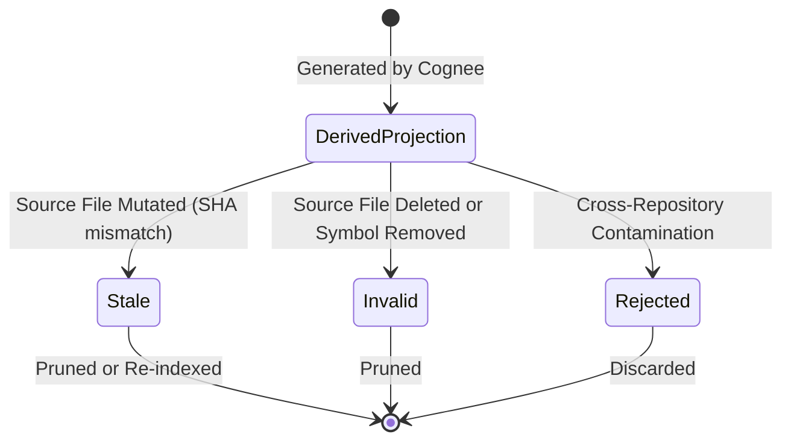

# RE:Track Memory Model & Semantic Memory Contract

## 1. Overview & Architecture

RE:Track maintains a strict hierarchy between **authoritative repository truth** and **derived memory projections**. 

Memory subsystems (vector embeddings in LanceDB, knowledge graphs in Kùzu, and semantic summaries via Cognee) are projections computed from the active repository manifest. They never hold authority over live source code or deterministic AST structures.

```
┌─────────────────────────────────────────────────────────┐
│              Authoritative Truth (Tier 1 & 2)           │
│   • Source Files on Disk (Tier 1)                       │
│   • AST Call Graph & Symbol Manifest (Tier 2)           │
└────────────────────────────┬────────────────────────────┘
                             │  Indexes / Projects
                             ▼
┌─────────────────────────────────────────────────────────┐
│               Derived Projections (Tier 3 & 4)          │
│   • LanceDB Embeddings & Kùzu Graphs (Tier 3)           │
│   • Cognee Semantic Memory Records (Tier 4)             │
└─────────────────────────────────────────────────────────┘
```

---

## 2. Semantic Memory Contract (`SemanticMemoryRecord`)

The `SemanticMemoryRecord` is the canonical domain model representing Cognee semantic text and natural language memory blocks.

### 2.1 Entity Schema

| Field | Type | Description |
|---|---|---|
| `memory_id` | `str` | Unique identifier for the semantic memory block |
| `repository_id` | `str` | Logical repository identifier or dataset name |
| `repository_fingerprint` | `str` | Cryptographic fingerprint of active repository snapshot |
| `semantic_text` | `str` | Natural language summary, explanation, or extracted insight |
| `source_files` | `list[str]` | List of referenced relative repository file paths |
| `source_symbols` | `list[str]` | List of symbols referenced in the semantic memory |
| `source_sha256` | `list[str]` | SHA-256 hashes of the referenced source files at generation time |
| `relationship_kind` | `Optional[str]` | Optional semantic relationship classification |
| `generated_by` | `str` | Generator pipeline identifier (default: `"cognee_pipeline"`) |
| `generated_at` | `float` | Unix timestamp of record generation |
| `evidence_status` | `str` | Lifecycle status (`"derived_projection"`, `"stale"`, `"invalid"`) |
| `is_derived` | `bool` | Invariant flag (always `True`) |
| `is_authoritative` | `bool` | Invariant flag (always `False`) |

---

## 3. Provenance & Invalidation Contract

### 3.1 Mandatory Anchoring
A semantic memory record **must** anchor to valid repository provenance:
1. `repository_id` and `repository_fingerprint` must be non-empty and match the active `RepositoryManifest`.
2. `source_files` must contain at least one valid source file.

### 3.2 Invalidation Conditions
A `SemanticMemoryRecord` is evaluated against the active `RepositoryManifest` via `validate_against_manifest(manifest)`. It is invalidated when:
- **Repository Mismatch**: `repository_fingerprint` does not match the manifest's `repo_fingerprint`.
- **File Deletion**: Any path in `source_files` no longer exists in `manifest.files`.
- **Source Mutation**: The recorded SHA-256 hash in `source_sha256` does not match the current file hash `manifest.files[path].sha256`.
- **Symbol Removal**: Any symbol in `source_symbols` is absent from `manifest.files[path].symbols`.

### 3.3 Strict Derived Tier Guarantee
- Semantic memory records reside strictly in **Authority Tier 4** (`AuthorityTier.TIER_4_COGNEE`).
- They can never be promoted to Tier 1 (Source Files) or Tier 2 (AST Structure).
- Under token budget constraints, Tier 4 records are evicted before Tier 1, Tier 2, or Tier 3 evidence.
- The arbitrator rejects invalid or stale records before ranking, ensuring 0 token budget is consumed by unverified memory.

---

## 4. Lifecycle States



1. **`derived_projection`**: Fresh, verified against active manifest. Eligible for Tier 4 residual token filling.
2. **`stale`**: Source code has changed since memory generation. Discarded prior to ranking.
3. **`invalid`**: Referenced files or symbols no longer exist. Discarded prior to ranking.
4. **`rejected`**: Foreign repository fingerprint. Discarded prior to ranking.
