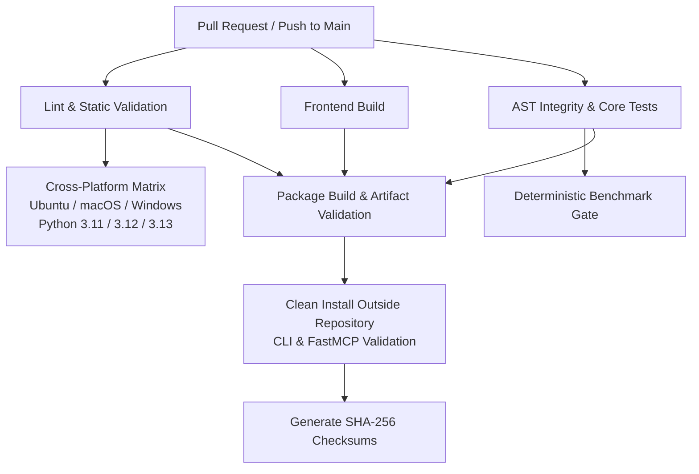

# Continuous Integration & Release Automation

This document defines the automated CI/CD architecture, platform compatibility matrix, retrieval benchmark regression gates, and release artifact validation pipelines for RE:Track.

---

## 1. CI Pipeline Architecture

RE:Track utilizes GitHub Actions for automated regression detection, static analysis, multi-platform compatibility, and release packaging.



### Job Classification

| Job Name | Trigger Scope | Platform / Python | Primary Validation Goal |
| :--- | :--- | :--- | :--- |
| `lint_and_static_validation` | PR & Main | Ubuntu 22.04 / Python 3.12 | Code formatting, syntax, architecture boundary tests. |
| `frontend_build` | PR & Main | Ubuntu 22.04 / Node.js 20 | TypeScript compiler (`tsc`) & Vite production bundling. |
| `ast_and_fast_backend_tests` | PR & Main | Ubuntu 22.04 / Python 3.12 | Multi-language AST parser, call graph, structured logging. |
| `golden_benchmark_regression` | PR & Main | Ubuntu 22.04 / Python 3.12 | Evaluates 20 golden tasks against frozen scorecard baseline. |
| `cross_platform_matrix` | PR & Main | Ubuntu, macOS, Windows (3.11, 3.12, 3.13) | Cross-OS portability and filesystem neutrality. |
| `package_build_and_clean_install` | PR & Main | Ubuntu 22.04 / Python 3.12 | Builds wheel/sdist, installs in clean venv, runs CLI/MCP. |

---

## 2. Platform Compatibility Matrix

RE:Track officially supports and tests the following platform matrix:

| Operating System | Supported Versions | Python Compatibility |
| :--- | :--- | :--- |
| **Linux** | Ubuntu 22.04 LTS+, Debian 12+, Arch Linux | `3.11`, `3.12`, `3.13` |
| **macOS** | macOS 13 (Ventura), macOS 14 (Sonoma), macOS 15 (Sequoia) | `3.11`, `3.12`, `3.13` |
| **Windows** | Windows 10 (21H2+), Windows 11 | `3.11`, `3.12`, `3.13` |

---

## 3. Retrieval Benchmark Regression Gate

The retrieval benchmark regression gate (`BenchmarkRegressionGate` in `app.evaluation.benchmark_gate`) prevents algorithmic degradation in context synthesis.

### Frozen Baseline & Tolerances

| Metric | Frozen Baseline | Allowable Tolerance | Minimum Acceptable Threshold |
| :--- | :--- | :--- | :--- |
| **Mean Precision@K** | `0.141` | `-0.050` | `0.091` |
| **Mean Recall@K** | `0.434` | `-0.050` | `0.384` |
| **Mean Critical Evidence Coverage** | `0.496` | `-0.050` | `0.446` |
| **Mean Noise Ratio** | `0.010` | `+0.040` | `<= 0.050` (Max) |

### Mathematical Rationale for Tolerances
- **Task Granularity**: With 20 discrete tasks in `golden_tasks.json`, a 1-task change in retrieved evidence produces a baseline perturbation of `1 / 20 = 0.050`.
- **Zero Hallucination Tolerance**: The noise ratio threshold is capped at `0.050` (5% maximum noise), guaranteeing that unneeded file content cannot pollute context packages.
- **Immutable Ground Truth**: `golden_tasks.json` and metric calculation formulas are frozen and never adjusted to fit implementation anomalies.

---

## 4. Single-Source Version Authority

RE:Track enforces a strict single-source versioning model:

1. **Authoritative Source**: `backend/app/__init__.py` defines `__version__ = "0.1.0"`.
2. **Dynamic Build Resolution**: `pyproject.toml` uses hatchling dynamic versioning:
   ```toml
   [project]
   dynamic = ["version"]

   [tool.hatch.version]
   path = "app/__init__.py"
   ```
3. **Runtime Reflection**:
   - `retrack --version` reads `app.__version__`.
   - `retrack-mcp` FastMCP server instantiates with `version=app.__version__`.
   - `SystemUseCases` derives `self.version = app.__version__`.
4. **Mechanical Drift Enforcement**: `tests/test_version_authority.py` fails CI if `package.json`, `tauri.conf.json`, or built distributions diverge from `app.__version__`.

---

## 5. Artifact Validation & Supply-Chain Hardening

### Positive Allowlist (Required)
- Core package root: `app/__init__.py`
- Architectural layers: `app/application/`, `app/domain/`, `app/services/`, `app/api/`, `app/cli/`, `app/mcp/`, `app/core/`, `app/config/`, `app/evaluation/`, `app/models/`
- Metadata: `entry_points.txt` defining `retrack` and `retrack-mcp` binaries.

### Negative Deny-List (Strictly Forbidden)
- Unit & integration tests (`tests/`, `test_*`)
- Version control metadata (`.git`, `.github`)
- Caches and virtual environments (`.pytest_cache`, `.venv`, `__pycache__`, `*.pyc`)
- Local state & databases (`*.sqlite`, `*.db`, `diagnostics/`, `diagnostic_bundle_*`)
- Secrets & configuration files (`.env*`, credentials)
- Frontend source checkouts (`node_modules`, `src/`, `src-tauri/`)
